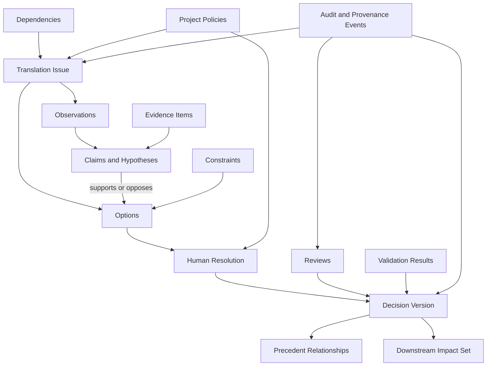
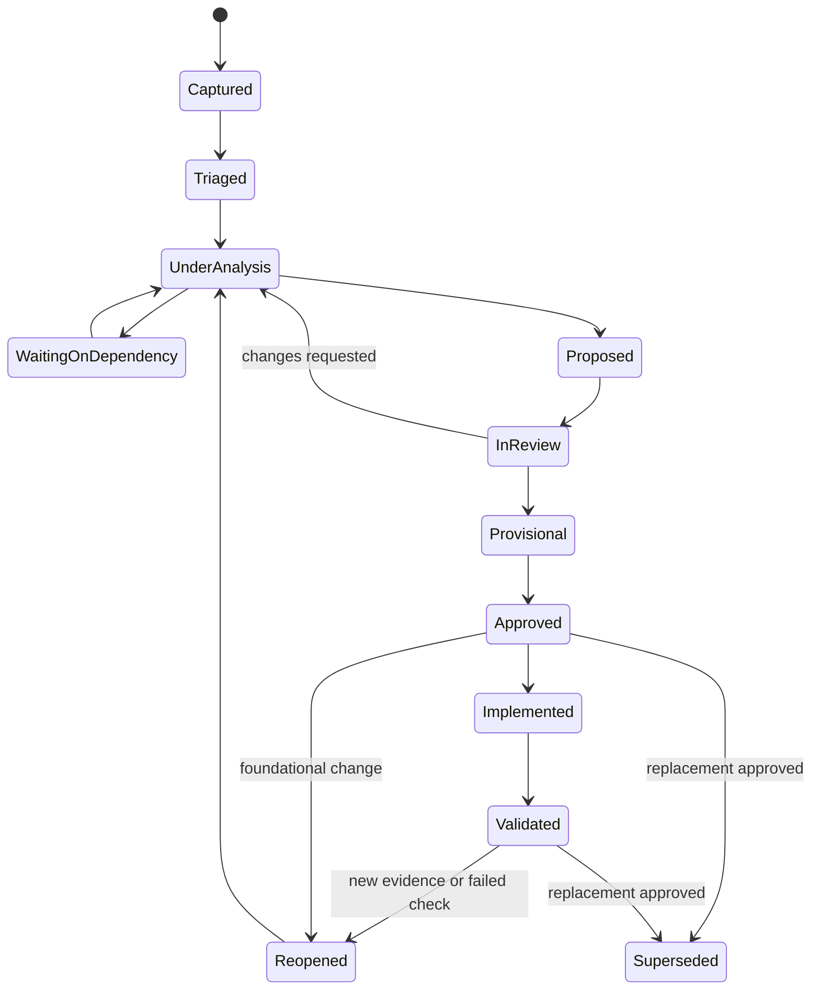
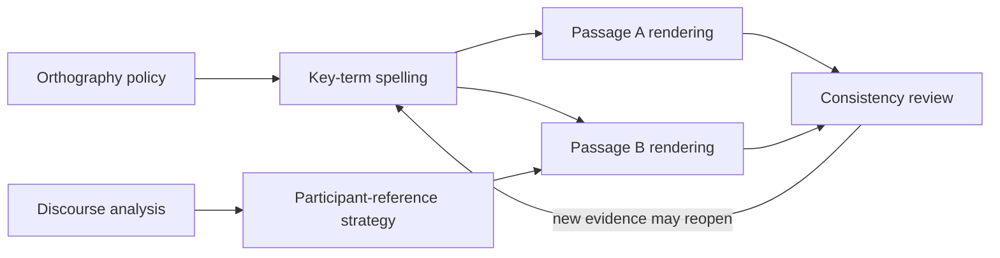
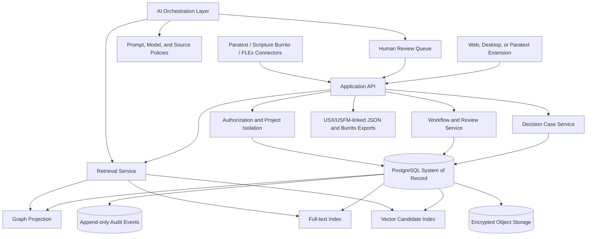
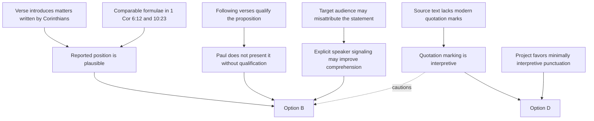

> **Authorship notice:** This document was generated by **OpenAI ChatGPT, GPT-5.6 Thinking**, on July 29, 2026. The filename and metadata intentionally preserve that provenance so other human and AI collaborators can identify its source.

# 1. Executive synthesis

The central insight is strong:

> **Bible-translation decisions can be treated as an interconnected, reviewable, reusable body of knowledge rather than as isolated notes attached to verses.**

The concept becomes substantially more defensible when the core object is not called simply a **decision**, but a **translation decision case**:

- A question or problem
- The relevant textual and linguistic context
- Structured observations
- Alternative interpretations or renderings
- Arguments and evidence
- Constraints and dependencies
- A versioned human resolution
- Reviews and validation results
- Relationships to earlier and later cases
- Provenance and change history

The system should therefore function as a combination of:

1. A **decision-case repository**
2. An **argument and evidence graph**
3. A **dependency-management system**
4. A **precedent-retrieval system**
5. A **translation-work prioritization tool**
6. An **auditable human-AI collaboration environment**

The system should initially be built as a **companion to Paratext and related tools**, not as a replacement for them. Paratext already supports project notes, Biblical Terms, checks, team synchronization, text access, and plugin/API extension points. This system should specialize in structured reasoning, precedent, dependency, impact, and provenance—areas not adequately represented by ordinary project notes.

## Most important refinements

### Replace a monolithic decision record with a layered case model

The smallest useful unit is not an entire decision record. It is usually a **claim, observation, option, or dependency assertion**. However, translators should interact with these units through a coherent **case**, rather than manipulating a raw knowledge graph.

### Treat precedent as advisory, not binding

The legal analogy is useful for:

- Citation
- Applicability
- Distinguishing characteristics
- Conflicting precedents
- Authority
- Supersession
- Exceptions
- Change propagation

It breaks down because translation projects have no equivalent of a single sovereign court, multiple renderings may be legitimate, authority is locally constituted, translation briefs differ, and community acceptability cannot be inherited from another project.

### Replace the “R-scale” with an explainable relevance profile

A single numerical distance would conceal important differences. Use a multidimensional **Precedent Applicability Profile**, optionally accompanied by a ranking score. Translators must be able to see *why* a case was retrieved.

### Separate deterministic state from AI inference

Dependency fulfillment, approval status, version supersession, access rights, and change propagation should be calculated from explicit records and rules. AI may suggest relationships but should not silently establish them.

### Validate retrieval before building ambitious AI

The thesis can be tested without automatic translation generation. A successful MVP only needs to demonstrate that structured cases help translators:

- Find earlier work
- Avoid duplicate research
- Make dependencies visible
- Maintain consistency
- Explain decisions
- Identify high-leverage work

# 2. Terminology and conceptual model

## Recommended terminology

| Term | Definition |
|---|---|
| **Translation decision case** | The container joining a translation issue, context, alternatives, arguments, dependencies, resolution, reviews, and provenance. |
| **Issue** | A question requiring investigation or resolution. |
| **Observation** | A descriptive assertion about the source text, target language, discourse, audience, culture, or project. It does not itself prescribe a rendering. |
| **Hypothesis** | A provisional interpretation that may explain one or more observations. |
| **Constraint** | A condition that limits acceptable options. |
| **Option** | A possible interpretation, policy, rendering, or course of action. |
| **Claim** | A proposition that can support, oppose, refine, or qualify another proposition. |
| **Evidence item** | A cited text, corpus result, linguistic analysis, community response, test result, or expert judgment. |
| **Resolution** | A human decision selecting, rejecting, combining, or postponing options. |
| **Decision version** | An immutable version of a resolution and its rationale. |
| **Project policy** | A decision intended to apply across a defined scope, such as an orthography or quotation-marking policy. |
| **Precedent candidate** | An earlier case retrieved as potentially relevant. |
| **Applicability assessment** | A human or system-supported evaluation of why a precedent applies, partially applies, or should be distinguished. |
| **Dependency** | A typed assertion that one case or artifact requires another condition to be met. |
| **Impact set** | The cases, passages, checks, or artifacts potentially affected by a change. |
| **Exception** | A deliberately documented departure from an otherwise applicable policy or precedent. |
| **Supersession** | Replacement of an earlier decision version while preserving its history. |
| **Validation result** | A result from consultant review, community testing, comprehension testing, consistency checking, oral testing, or another checking procedure. |

## What is the smallest useful unit?

There are two answers:

- **For computation:** an atomic assertion, relationship, or event.
- **For human work:** a translation decision case.

A case should therefore be a composed object rather than one flattened database row.

## Recommended representational model

Use four interlocking representations:

1. **Case record:** the translator-facing unit.
2. **Argument subgraph:** claims, evidence, attacks, support, and alternatives.
3. **Decision event stream:** immutable creation, review, approval, revision, and supersession events.
4. **Relationship graph:** dependencies, precedents, shared features, and impacts.

Case-based reasoning is a useful conceptual precedent because its conventional cycle retrieves prior cases, reuses applicable knowledge, revises it for the present case, and retains reviewed new experience. It should inform the workflow, but not become the complete data model.

Argumentation frameworks such as the Argument Interchange Format demonstrate how information nodes, inference applications, conflicts, and preferences can be represented separately. The system should borrow that separation without requiring translators to learn formal argumentation notation.



## Where the legal-precedent analogy helps

Computational legal reasoning has long represented cases through relevant facts or factors, analogies, competing precedents, and distinguishing differences. This is especially relevant to the proposal: a precedent can appear similar but become inapplicable because of one decisive characteristic.

| Legal concept | Translation equivalent | Limitation |
|---|---|---|
| Jurisdiction | Project, language variety, audience, medium, translation brief | Boundaries may overlap rather than being exclusive. |
| Authority | Approval level, reviewer competence, local ownership, evidence quality | External expertise does not override local authority. |
| Holding | Approved resolution within an explicit scope | Translation resolutions may remain provisional. |
| Facts | Source-text and target-context characteristics | Linguistic “facts” may themselves be interpretive. |
| Distinguishing | Showing why a prior case should not control the present one | Differences are often gradients, not binary distinctions. |
| Overruling | Superseding a project policy or decision | No universal tribunal determines all projects. |
| Persuasive authority | External project precedent | Usually the correct treatment for cross-project cases. |
| Binding authority | Mandatory project policy | Should be rare and explicitly defined by the project. |

# 3. Research and prior-art landscape

The system should reuse existing standards for Scripture content, annotation, provenance, language identification, and linguistic data instead of inventing replacements.

## Bible-translation ecosystem

| Resource | What it contributes | Recommended use | Licensing/access concern |
|---|---|---|---|
| **Paratext** | Scripture editing, project notes, Biblical Terms, checking, collaboration, text and notes APIs, plugin extension points | Primary workflow integration; deep-link cases to Scripture; import notes and term decisions where authorized | Registered project membership and resource permissions must be respected. Protected resources cannot be extracted merely because a plugin can display them. |
| **USFM, USX, USJ** | Widely used encodings for Scripture text and structure | Canonical Scripture anchors and source/target text interchange | Use current official specifications and confirm repository-level licensing for code or schemas separately from text copyright. USX is XML; USFM is marker-based plain text. |
| **Scripture Burrito** | Portable metadata wrapper for Scripture text, audio, alignment, derived projects, and other Bible-centric resources | Export decision cases as a custom or parascriptural decision package; include reference scope, provenance, license, and project metadata | Documentation is CC BY-SA 4.0; schema and code are MIT-licensed. Content inside a package retains its own rights. |
| **FieldWorks Language Explorer** | Lexicon, morphology, interlinear texts, lexical relations, corpus concordance, and cultural information | Link target-language lexical entries, senses, morphemes, and interlinear examples | Integration should map rather than duplicate lexical databases. Confirm the license of each software component and exported dataset. |
| **Scripture Forge** | Team translation, community review, and AI-assisted functionality | Comparable workflow and possible future integration partner; study its human-review patterns | Do not assume its project data is available for reuse. |
| **BART and enhanced resources** | Original-language features and links between source-language elements and translation resources | Possible evidence links and source-language feature inputs | Resource licensing can be restrictive; store identifiers and authorized links rather than copying protected content. |

## Linguistic and knowledge-representation standards

| Resource | Contribution | Use in the system | Weakness or caution |
|---|---|---|---|
| **W3C PROV-O / PROV-DM** | Entities, activities, agents, derivation, attribution, generation, and revision provenance | Map decision versions, reviews, evidence use, AI transformations, and imported records | Too generic for translation reasoning; create a domain profile rather than exposing raw PROV terms to users. |
| **W3C Web Annotation** | Standardized association of annotation bodies with target resources and selectors | Anchor decisions and observations to verses, spans, tokens, audio timecodes, or sign-language segments | Scripture versification and mutable drafts require stable selectors plus revision identifiers. |
| **Universal Dependencies** | Cross-linguistic POS, morphological features, and syntactic dependencies | Optional structured source- or target-language observations; useful for feature matching | UD is primarily syntactic and does not encode all semantics, pragmatics, idioms, or discourse. Individual treebank licenses vary. |
| **ISO 24617 SemAF** | Standards covering semantic roles, reference, dialogue acts, discourse relations, time, spatial semantics, and other annotation domains | Source vocabulary for selected structured observations and relation mappings | Standards are often paywalled; several parts address narrow annotation tasks rather than full translation reasoning. |
| **Rhetorical Structure Theory** | Functional relationships among text spans, including nuclearity and rhetorical relations | Optional discourse annotation layer and precedent feature | Analyses can vary among analysts; do not convert every rhetorical judgment into an unquestioned fact. |
| **SIL discourse-for-translation resources** | Translation-oriented treatment of participant reference, conjunctions, prominence, constituent order, and related discourse features | Strong basis for the initial discourse vocabulary and translator-facing categories | Some resources are pedagogical frameworks rather than interoperable machine-readable standards. |
| **Glottolog** | Language and family identifiers, classifications, bibliographic information, and multiple machine-readable formats | Language-family metadata and stable Glottocodes | Genealogy must not be mistaken for feature similarity. |
| **ISO 639** | Standard language identifiers | Interchange and external compatibility | A language code is not sufficient to represent dialect, register, community, script, or project-specific variety. |
| **CLDF** | Structured, reusable cross-linguistic datasets with tabular files and metadata | Import typological and comparative features; export anonymized research datasets | Dataset licenses vary; CLDF describes data structure but does not establish relevance to a translation case. |
| **FrameNet** | Lexical units organized into semantic frames and frame elements | Conceptual inspiration for frame-based lexical and event observations | Coverage is language- and resource-dependent; frames must not be projected uncritically onto minority languages. |
| **Architecture Decision Records** | Lightweight recording of context, decision, status, and consequences | Useful simplicity principle for the case summary view | Ordinary ADRs are too flat for competing claims, dependencies, Scripture anchoring, and community review. |
| **MQM** | Analytic translation error typology and severity-based evaluation | Adapt selected categories for research evaluation, not as a complete Bible-translation quality definition | Requires domain adaptation; generic translation-error categories do not fully measure exegetical, communal, oral, or theological adequacy. |

## Direct precedents versus analogies

### Direct precedents

- Paratext notes and Biblical Terms
- Scripture Forge review workflows
- FLEx lexical and interlinear records
- Scripture Burrito packaging
- USFM/USX/USJ Scripture anchoring
- Translation terminology and quality-management systems

### Strong structural analogies

- Case-based reasoning
- Legal precedent modeling
- Requirements traceability
- Architecture decision records
- Argument graphs
- Software dependency management
- Clinical decision support
- Provenance systems

### Weaker analogies

- Social recommendation engines
- Generic vector-search knowledge bases
- Fully autonomous machine translation
- Citation-counting systems
- A universal numerical “distance” between translation problems

# 4. Proposed domain model

## Principal entities

### Context and identity

- `Organization`
- `Project`
- `ProjectVersion`
- `LanguageVariety`
- `AudienceProfile`
- `MediumProfile`
- `TranslationBrief`
- `User`
- `Role`
- `PermissionGrant`

### Scripture and linguistic anchoring

- `ScriptureAnchor`
- `TextRevision`
- `TextSpan`
- `SourceToken`
- `TargetSpan`
- `AudioSpan`
- `SignSegment`
- `Lexeme`
- `Sense`
- `SemanticDomain`
- `Construction`
- `DiscourseUnit`
- `Participant`
- `LanguageFeature`

### Decision knowledge

- `DecisionCase`
- `Issue`
- `Observation`
- `Hypothesis`
- `Constraint`
- `Option`
- `Claim`
- `EvidenceItem`
- `Citation`
- `DecisionVersion`
- `Rationale`
- `Exception`
- `ProjectPolicy`

### Graph and workflow

- `ArgumentRelation`
- `Dependency`
- `PrecedentLink`
- `ApplicabilityAssessment`
- `ImpactLink`
- `Assignment`
- `Review`
- `ValidationResult`
- `ChangeRequest`

### Provenance and AI

- `AuditEvent`
- `AIInteraction`
- `RetrievalRun`
- `Suggestion`
- `ModelDescriptor`
- `ImportBatch`
- `ExportBatch`

## Property versus relationship

Use properties for information intrinsic to one entity:

- Title
- Status
- Confidence
- Created date
- Risk rating
- Scope
- Current version
- Access classification

Use relationships for facts involving two independently meaningful objects:

- Decision **applies to** passage
- Observation **concerns** participant
- Claim **supports** option
- Case **depends on** policy
- Decision **supersedes** decision
- Precedent **is distinguished from** current case
- Evidence **supports** claim
- Review **evaluates** decision version

Avoid fields such as:

```text
related_decisions: "D12, D15, D27"
dependencies: "orthography, key terms"
evidence: "See commentary and discussion"
```

Those should be normalized into typed entities and edges.

## Lifecycle states

Separate the state of the **issue** from the state of the **resolution**.

### Issue states

- Captured
- Triaged
- Under analysis
- Waiting on dependency
- Ready for resolution
- Resolved
- Reopened
- Closed without resolution

### Decision-version states

- Draft
- Proposed
- Provisional
- In review
- Approved
- Implemented
- Validated
- Superseded
- Withdrawn



## Provenance requirements

Every substantive assertion should record:

- Author or importing agent
- Creation time
- Source
- Source revision
- Confidence
- Whether human-authored, imported, algorithmically derived, or AI-suggested
- Review state
- Later corrections
- Access classification

PROV-O’s agent/activity/entity pattern is suitable for interchange, but the operational interface should use translation-specific language.

# 5. Relevance and precedent framework

## Recommendation: do not use a universal “R-scale”

Retain the intuitive goal but rename it:

> **Precedent Applicability Profile**, or **PAP**

The profile should contain:

1. Hard eligibility rules
2. A multidimensional relevance vector
3. An optional ranking score
4. An authority and trust profile
5. Human applicability judgments
6. Recorded distinguishing characteristics

## Relevance dimensions

### Source-text dimensions

- Same passage
- Same lemma
- Same lexeme and sense
- Same semantic domain
- Same morphology
- Same syntactic construction
- Same discourse relation
- Same participant-reference pattern
- Same rhetorical or pragmatic function
- Same intertextual relationship
- Same textual variant

### Target-context dimensions

- Same target language
- Same variety or dialect
- Same grammatical feature
- Same lexical gap
- Same honorific system
- Same kinship system
- Same sociolinguistic condition
- Same oral, written, signed, or multimedia medium
- Same audience profile

### Project-governance dimensions

- Same project
- Same translation brief
- Same key-term policy
- Same reviewer jurisdiction
- Same approval authority
- Same source-text edition
- Same project phase

### Problem-structure dimensions

- Shared dependency
- Shared constraint
- Same option pattern
- Same validation failure
- Same downstream consequence
- Same exception condition

## Hard rules versus weighted indicators

### Hard exclusions or warnings

- User lacks permission to view the source case
- Case is from an incompatible confidential project
- Decision is withdrawn or superseded and not requested historically
- Source-text edition materially differs
- Explicit project policy conflicts
- Case concerns a different sense despite sharing a lemma
- Imported record has unverified provenance
- External case lacks community authorization for reuse

### Weighted indicators

- Lexical similarity
- Shared semantic-domain label
- Similar discourse function
- Typological similarity
- Genre similarity
- Shared speaker
- Vector similarity of rationales
- Common evidence sources

## Proposed scoring approach

A score may rank candidates but must never be displayed without its component explanation.

```text
eligibility = access_gate
              × status_gate
              × compatibility_gate

raw_relevance =
    Σ(weight_i × dimension_similarity_i × dimension_confidence_i)

applicability_score =
    eligibility
    × raw_relevance
    × authority_factor
    × evidence_quality_factor
    × freshness_factor
```

Important constraints:

- `eligibility` may be zero.
- Weights should initially be configured by project and case category.
- Similarity must not imply authority.
- Vector similarity should generate candidates, not final rankings by itself.
- A high score must remain distinguishable by a human.

## Retrieval pipeline

1. Filter by access and project policy.
2. Apply exact symbolic matches.
3. Expand through graph relationships.
4. Run full-text and vector retrieval.
5. Re-rank using relevance dimensions.
6. Diversify results so the top five are not duplicates.
7. Explain each result.
8. Let the translator mark:
   - Applied
   - Applied with adaptation
   - Informative only
   - Distinguished
   - Incorrectly retrieved
   - Inaccessible evidence
9. Retain this feedback for evaluation and later supervised ranking.

## Validation

Create a gold-standard set in which at least two experienced translators independently identify relevant precedents for historical cases.

Measure:

- Precision at 3 and 5
- Recall at 10
- Mean reciprocal rank
- Normalized discounted cumulative gain
- Time to first useful precedent
- Percentage of results translators can explain
- False-similarity categories
- Inter-reviewer agreement
- Frequency of successful distinguishing

False positives should be categorized, not merely counted:

- Same lemma, wrong sense
- Same construction, different discourse function
- Same language family, irrelevant typology
- Same theology label, different textual question
- Same rendering, different rationale
- Same project, obsolete policy
- Similar wording, different participant structure

# 6. Dependency and prioritization framework

## Dependency object

A dependency should contain:

- Source case or artifact
- Required case, artifact, state, or predicate
- Dependency type
- Hard or soft classification
- Blocking behavior
- Scope
- Confidence
- Creator
- Fulfillment rule
- Current state
- Evidence of fulfillment
- Waiver authority
- History

## Dependency categories

| Axis | Values |
|---|---|
| Strength | Hard, soft |
| Function | Evidentiary, interpretive, procedural, technical, governance |
| Scope | Project-wide, book, discourse unit, passage, decision |
| Effect | Blocking, advisory, risk-increasing |
| Status certainty | Confirmed, hypothesized |
| Fulfillment | Human, automated, hybrid |
| Direction | Direct, transitive |
| Duration | Temporary, continuing |

## Dependency states

- Proposed
- Confirmed
- Partially satisfied
- Satisfied
- Invalidated
- Waived
- Superseded
- Reopened
- Failed

## Deterministic fulfillment

A dependency should specify a machine-testable predicate whenever possible.

```text
Dependency:
  "Participant-reference policy must be approved"

Fulfillment predicate:
  required_entity_type = PROJECT_POLICY
  required_category = PARTICIPANT_REFERENCE
  required_scope_contains = "1 Corinthians"
  required_status in [APPROVED, VALIDATED]
  minimum_reviews = 2
  required_reviewer_roles includes CONSULTANT
```

AI can suggest that such a dependency exists. AI should not decide that it has been fulfilled.

```pseudo
function evaluateDependency(dependency, state):
    if dependency.status in ["superseded", "invalidated"]:
        return dependency.status

    facts = loadRequiredFacts(dependency.fulfillmentPredicate, state)

    if facts.meetsAllRequiredConditions():
        return "satisfied"

    if facts.meetsAnyRequiredCondition():
        return "partially_satisfied"

    if dependency.waiver is active:
        return "waived"

    return "confirmed"
```

## Cycles

A strict dependency DAG is useful for blocking work, but real translation reasoning may contain cycles:

- A discourse analysis affects participant reference.
- Participant-reference examples affect the discourse analysis.
- Key-term choices influence passage interpretation.
- Passage interpretation influences key-term sense distinctions.

Use two graphs:

1. **Execution dependency graph:** confirmed blocking dependencies, ideally acyclic.
2. **Reasoning relationship graph:** may contain cycles.

When blocking dependencies form a cycle:

- Identify the strongly connected component.
- Create a joint resolution bundle.
- Require simultaneous or staged provisional decisions.
- Do not pretend topological sorting alone solves the problem.



## Change propagation

When a foundational decision changes:

1. Create a new decision version.
2. Preserve the prior version.
3. Compute its direct and transitive impact set.
4. Classify affected relationships:
   - Hard-invalidated
   - Needs review
   - Informational only
5. Freeze silent propagation.
6. Create review tasks.
7. Show the old and new rationale.
8. Record whether downstream cases were:
   - Affirmed unchanged
   - Revised
   - Distinguished
   - Deferred

Do not automatically change approved Scripture renderings merely because an upstream policy changed.

## Prioritization model

Graph centrality should be one input, not the governing objective.

### Proposed formula

```text
priority =
  downstream_blocked_value
  + expected_reuse_value
  + risk_reduction_value
  + deadline_value
  + reviewer_readiness
  + information_gain
  - estimated_effort
  - coordination_cost
  - uncertainty_penalty
```

Suggested components:

- Number of blocked decisions
- Weighted importance of blocked passages
- Probability the work will actually resolve them
- Number of projects or books likely to reuse the result
- Risk of proceeding inconsistently
- Translator and reviewer availability
- Estimated research effort
- Urgency
- Whether required data already exists

Recommendations should read like this:

> Resolving this quotation-policy question is recommended because it blocks 7 cases in 1 Corinthians, affects the audio-rendering policy, and has all required evidence available. Estimated effort: medium. Confidence that it will unlock downstream work: 0.78.

Not:

> Translate 1 Corinthians 7 next because its centrality is 0.843.

# 7. User experience and workflows

## Design principle: progressive disclosure

A translator should be able to create an issue in under a minute:

- Scripture reference
- Brief question
- Category
- Optional note

The system can then progressively invite additional structure.

Experts may open:

- Argument map
- Source-text features
- Discourse annotation
- Dependencies
- Precedent assessment
- Provenance
- Validation history

Community reviewers may see only:

- Passage
- Audio or text version
- Plain-language question
- Alternatives
- Response form

## Major views

### Scripture-first view

Displays:

- Current translation text
- Source and reference resources where authorized
- Cases anchored to the selected passage
- Open questions
- Approved decisions
- Dependencies
- Key terms
- Discourse units
- Precedent suggestions
- Review results
- Change warnings

### Decision-first view

Filter and sort by:

- Status
- Category
- Risk
- Confidence
- Importance
- Review state
- Dependency completion
- Downstream impact
- Assigned person
- Project or book
- Relevance to current case
- Last meaningful activity

### Dependency view

- Blocking graph
- Bottlenecks
- Cycles
- Satisfied and partially satisfied prerequisites
- Potential high-leverage work
- Change-impact simulation

### Precedent network

- Cited precedents
- Applied precedents
- Distinguished precedents
- Conflicts
- Superseded cases
- External-project cases
- Authority and trust indicators

### Reviewer queue

- Review role required
- Risk
- Due date
- Evidence completeness
- Precedent conflicts
- AI involvement
- Downstream impact

### Risk and uncertainty dashboard

- High-impact provisional decisions
- Approved decisions with weak evidence
- Cases relying on superseded precedents
- Unreviewed AI-derived observations
- Translation renderings affected by reopened dependencies
- Cross-project imports awaiting local assessment

## Representative workflow

1. Translator notices a problem while working in Paratext.
2. Opens the companion panel or plugin.
3. Creates a question anchored to the verse and text revision.
4. Adds observations or imports an existing project note.
5. System retrieves potential precedents.
6. Translator accepts, rejects, or distinguishes them.
7. Translator records alternatives.
8. AI may propose a structured summary and missing questions.
9. Translator edits the structure.
10. Dependencies are added.
11. A provisional resolution is recorded.
12. Required reviewers are assigned.
13. Review comments attach to a specific decision version.
14. The decision is approved.
15. The implementation is linked to the revised target-text span.
16. Checking and community results are recorded.
17. The decision becomes eligible as a precedent.
18. Later changes trigger impact review.

# 8. AI and deterministic-system boundaries

## Responsibility matrix

| Activity | Human | Conventional software | Rules/graph | Retrieval | Generative AI |
|---|---:|---:|---:|---:|---:|
| Frame the translation question | **Authority** | Store and validate | Suggest required fields | Find similar questions | Draft wording |
| Describe target-language behavior | **Authority** | Store examples | Validate required evidence | Retrieve corpus examples | Suggest hypotheses |
| Interpret source text | **Authority** | Display authorized resources | Apply explicit mappings | Retrieve evidence | Compare interpretations |
| Select final rendering | **Exclusive authority** | Record and version | Enforce approval workflow | Show precedents | May recommend only |
| Approve a decision | **Exclusive authority** | Enforce role permissions | Check approval conditions | — | Never |
| Determine dependency status | Override/waive | Maintain state | **Primary executor** | — | Suggest dependencies only |
| Detect impacted cases | Review result | Maintain versions | **Primary executor** | Retrieve related cases | Summarize likely consequences |
| Retrieve precedents | Judge applicability | Filter access | Graph expansion and scoring | **Primary executor** | Explain and compare |
| Create rationale | Author or approve | Store version | Check completeness | Retrieve sources | Draft from verified evidence |
| Verify citations | Confirm relevance | Resolve identifiers | Enforce source rules | Fetch authorized source | Never invent missing citations |
| Cross-project sharing | Grant consent | Enforce ACLs | Apply trust policy | Search permitted corpus | No unrestricted access |
| Change approved text | **Exclusive authority** | Apply explicit edit | Block unauthorized changes | — | Never silently edit |

## Required AI safeguards

### Provenance

Record:

- Prompt template
- User input
- Retrieved evidence identifiers
- Model provider and version
- Generation settings
- Output
- Human edits
- Acceptance or rejection
- Final linked decision version

### Grounding

AI-generated claims should be classified as:

- Directly supported
- Inferred from cited evidence
- Proposed hypothesis
- Unverified

### Isolation

- Project-level retrieval boundaries
- Organization-level encryption keys where necessary
- No model-training reuse without explicit consent
- Redaction of names and sensitive community data
- Separate indexes for confidential projects
- No cross-project embedding search unless sharing is authorized

### Human factors

NIST’s AI risk framework treats AI as a socio-technical system and recommends explicit governance, documentation, role differentiation, and human oversight. Those principles are directly applicable even though the framework is not translation-specific.

## What should not use generative AI

- Approval state
- Access control
- Dependency fulfillment
- Supersession state
- Passage identifiers
- Versification conversion
- Version comparison
- Audit logging
- Required-review calculation
- License restrictions
- Source authenticity
- Exact counts and graph traversal
- Publication readiness gates

# 9. Technical architecture

## Recommended architecture

Use a **relational system of record with graph projections**, not a graph-only system.

### Operational stack

- PostgreSQL as canonical database
- JSONB for extensible structured observations
- PostgreSQL full-text search initially
- `pgvector` or an external vector index for candidate generation
- Recursive SQL for initial dependency traversal
- Optional graph projection into Neo4j, Apache AGE, or another graph engine later
- Object storage for attachments, exports, audio, and immutable evidence snapshots
- Append-only audit-event table
- Rules implemented in typed application code and SQL
- Background jobs for indexing and impact computation
- JSON Schema for interchange validation
- JSON-LD export for semantic interoperability
- Scripture Burrito package for project-level export
- Local encrypted SQLite store for later offline-first clients

## Why this architecture

A relational database provides:

- Strong constraints
- Transactions
- Role-based data isolation
- Familiar migrations
- Version integrity
- Deterministic workflow queries

A graph projection provides:

- Precedent networks
- Dependency traversal
- Centrality
- Impact analysis
- Path explanations

A vector index provides:

- Candidate discovery from notes and rationales

None should become the sole source of truth.



## Credible alternatives

### Alternative A: property-graph-first

**Stack:** Neo4j plus object storage and search.

**Advantages**

- Natural graph modeling
- Fast path and centrality queries
- Good graph visualization

**Disadvantages**

- Workflow, access control, audit integrity, and transactional versioning become harder
- Developers may place unstable descriptive data directly on edges
- Graph migrations can become less disciplined
- Offline synchronization is difficult

### Alternative B: RDF knowledge graph

**Stack:** RDF store, OWL/SHACL, SPARQL, PROV-O, Web Annotation, JSON-LD.

**Advantages**

- Strong interoperability
- Standards-based semantics
- External ontology mapping
- Excellent long-term export model

**Disadvantages**

- Higher ontology-engineering burden
- Harder for ordinary product developers
- Open-world assumptions may conflict with workflow validation
- More difficult operational UX and transactional behavior

### Alternative C: local-first document system

**Stack:** SQLite or embedded document database, append-only events, peer synchronization.

**Advantages**

- Strong field usability
- Intermittent-connectivity support
- Local control

**Disadvantages**

- Conflict resolution for approvals and supersession is difficult
- Search and cross-project graph analysis are more complex
- Security and data revocation need careful design

### Recommendation

- MVP: relational only, with recursive queries and vector retrieval.
- Pilot: add graph projection.
- Production field version: add encrypted local store and explicit synchronization protocol.
- Interchange: provide JSON-LD and Scripture Burrito exports without requiring RDF operationally.

## Example tables

```sql
decision_cases
- id
- project_id
- title
- primary_issue_id
- category_id
- importance
- risk
- confidentiality_level
- created_by
- created_at

issues
- id
- case_id
- question
- status
- scope_type
- scope_id

case_assertions
- id
- case_id
- assertion_type
- body
- confidence
- authorship_type
- created_by
- source_revision_id

decision_versions
- id
- case_id
- version_number
- resolution_type
- resolution_body
- status
- effective_scope
- supersedes_version_id
- created_by
- created_at

relationships
- id
- subject_type
- subject_id
- predicate
- object_type
- object_id
- confidence
- status
- provenance_event_id

dependencies
- id
- dependent_case_id
- prerequisite_type
- prerequisite_id
- dependency_type
- strength
- blocking
- fulfillment_rule_json
- state

reviews
- id
- decision_version_id
- reviewer_id
- reviewer_role
- disposition
- body
- created_at

audit_events
- id
- project_id
- actor_type
- actor_id
- event_type
- entity_type
- entity_id
- previous_hash
- payload_hash
- payload_json
- created_at
```

## Example decision JSON

```json
{
  "id": "case:1co-7-1-quotation",
  "type": "translationDecisionCase",
  "projectId": "project:demo-1co",
  "title": "Speaker status of 1 Corinthians 7:1b",
  "anchors": [
    {
      "reference": "1CO 7:1",
      "textRevisionId": "revision:grc-source-2026-01",
      "selector": {
        "type": "tokenRange",
        "startToken": "tok-1co-7-1-12",
        "endToken": "tok-1co-7-1-18"
      }
    }
  ],
  "issue": {
    "question": "Should the clause be represented as Paul's assertion or as a Corinthian slogan that Paul qualifies?",
    "status": "underAnalysis"
  },
  "options": [
    {
      "id": "option:a",
      "label": "Pauline assertion"
    },
    {
      "id": "option:b",
      "label": "Corinthian slogan, partly affirmed and qualified"
    },
    {
      "id": "option:c",
      "label": "Corinthian slogan, rejected"
    }
  ],
  "currentDecisionVersion": {
    "version": 2,
    "status": "provisional",
    "selectedOptionId": "option:b",
    "renderingStrategy": "mark as reported statement and clarify the response transition",
    "confidence": 0.68
  },
  "provenance": {
    "humanAuthored": true,
    "aiAssistanceUsed": true,
    "aiOutputApproved": false
  }
}
```

## Example dependency JSON

```json
{
  "id": "dependency:quote-policy",
  "dependentCaseId": "case:1co-7-1-quotation",
  "prerequisite": {
    "type": "projectPolicy",
    "category": "unmarkedQuotation"
  },
  "dependencyType": "procedural",
  "strength": "hard",
  "blocking": true,
  "state": "partiallySatisfied",
  "fulfillmentRule": {
    "requiredStatus": ["approved", "validated"],
    "minimumReviews": 2,
    "requiredRoles": ["translator", "consultant"],
    "scopeMustContain": "1 Corinthians"
  }
}
```

## Example precedent link

```json
{
  "currentCaseId": "case:1co-7-1-quotation",
  "precedentCaseId": "case:1co-6-12-slogan",
  "relation": "analogousTo",
  "relevanceProfile": {
    "sameBook": 1.0,
    "sameAuthorialDiscoursePattern": 0.9,
    "sameQuotationProblem": 0.95,
    "sameLexicalMaterial": 0.1,
    "sameTargetMedium": 1.0
  },
  "authority": {
    "sameProject": true,
    "reviewStatus": "approved",
    "externalAuthority": false
  },
  "humanAssessment": {
    "disposition": "appliedWithAdaptation",
    "distinguishingCharacteristics": [
      "1 Corinthians 7:1 explicitly refers to matters written by the Corinthians",
      "The surrounding response structure differs"
    ]
  }
}
```

## Example review

```json
{
  "id": "review:8871",
  "decisionVersionId": "decision-version:1co-7-1:v2",
  "reviewer": {
    "id": "user:consultant-4",
    "role": "translationConsultant"
  },
  "disposition": "changesRequested",
  "comments": [
    {
      "type": "evidenceGap",
      "body": "Document the criteria used to identify unmarked quotations elsewhere in the letter."
    },
    {
      "type": "mediumConcern",
      "body": "The proposed distinction is not yet testable in the oral version."
    }
  ],
  "createdAt": "2026-07-29T18:15:00Z"
}
```

## Representative APIs

```text
POST   /projects/{projectId}/cases
GET    /projects/{projectId}/scripture/{reference}/cases
GET    /cases/{caseId}
POST   /cases/{caseId}/observations
POST   /cases/{caseId}/options
POST   /cases/{caseId}/decision-versions
POST   /cases/{caseId}/dependencies
GET    /cases/{caseId}/dependencies
GET    /cases/{caseId}/precedent-candidates
POST   /cases/{caseId}/precedent-assessments
GET    /cases/{caseId}/impact
POST   /decision-versions/{versionId}/reviews
POST   /decision-versions/{versionId}/approve
POST   /decision-versions/{versionId}/reopen
POST   /ai/structure-case
POST   /ai/suggest-precedents
POST   /imports/scripture-burrito
GET    /exports/scripture-burrito
```

## Precedent retrieval pseudocode

```pseudo
function retrievePrecedents(currentCase, user, k = 10):
    permittedCorpus = accessControl.filterCorpus(user)

    exactCandidates = symbolicSearch(
        corpus = permittedCorpus,
        anchors = currentCase.anchors,
        lemmas = currentCase.lemmas,
        senses = currentCase.senses,
        constructions = currentCase.constructions,
        dependencies = currentCase.unresolvedDependencies,
        projectPolicies = currentCase.applicablePolicies
    )

    graphCandidates = graph.expand(
        seeds = exactCandidates + currentCase.relatedEntities,
        allowedRelations = [
            "analogousTo",
            "sharesConstruction",
            "sharesDiscourseFunction",
            "dependsOn",
            "appliesPolicy",
            "distinguishedFrom"
        ],
        maxDepth = 2
    )

    semanticCandidates = vectorSearch(
        text = currentCase.question + currentCase.observations,
        corpus = permittedCorpus,
        limit = 50
    )

    candidates = union(exactCandidates, graphCandidates, semanticCandidates)

    candidates = candidates.filter(notSupersededUnlessRequested)
    candidates = candidates.filter(sourceVersionCompatible)
    candidates = candidates.filter(noExplicitPolicyConflict)

    scored = candidates.map(candidate =>
        calculateApplicabilityProfile(currentCase, candidate)
    )

    return diversifyAndExplain(scored, k)
```

## External-resource mapping

Do not ingest every resource into one ontology.

Use adapters:

```text
USFM/USX/USJ → Scripture anchors and text revisions
Scripture Burrito → package metadata, scope, ingredients, license
Paratext notes → imported issue or evidence item
Paratext Biblical Terms → key-term entity and rendering observations
FLEx/LIFT → target lexeme, sense, morpheme, example, lexical relation
UD → morphology and syntax observations
Glottolog/ISO 639 → language identity
CLDF → typological dataset metadata and feature observations
PROV-O → provenance export
Web Annotation → portable selectors
```

# 10. MVP definition

## MVP thesis

> A team can resolve recurring translation questions more efficiently and consistently when prior decisions are structured, linked, and retrieved with explainable applicability information.

## In scope

- One translation project
- One biblical book or closely connected passage corpus
- Structured case creation
- Scripture anchoring
- Options, observations, evidence, and rationale
- Versioned decisions
- Human review and approval
- Explicit dependencies
- Precedent candidate retrieval
- Human applicability assessments
- Impact analysis
- Audit history
- Paratext deep links or limited authorized import
- JSON export
- Basic Scripture Burrito-compatible package

## Explicitly excluded

- Autonomous Scripture translation
- Automatic decision approval
- A universal translation ontology
- Unrestricted cross-project search
- Training a translation foundation model
- Automatic theological adjudication
- Full typological inference
- Automatic consultant checking
- Production-grade multi-master offline synchronization
- A graph database unless relational traversal proves inadequate
- Quantitative claims about translation quality before a validated study

## Required initial data

- 50–150 historical translation questions
- Their passages
- Final or provisional resolutions
- Available rationales
- Alternatives where recoverable
- Review status
- Key-term and project-policy links
- At least some known relationships among cases

It is better to have 75 carefully curated cases than 5,000 automatically extracted notes with unreliable structure.

## Suggested technology

- TypeScript
- PostgreSQL
- JSON Schema
- React or another familiar component framework
- PostgreSQL full-text search
- `pgvector`
- Object storage
- Background worker
- Paratext extension, Platform.Bible extension, or sidecar web application after confirming the supported integration route

## Prototype screens

1. Scripture workspace
2. Case editor
3. Precedent comparison panel
4. Dependency board
5. Review queue
6. Change-impact panel
7. Search and filter view
8. AI activity and provenance panel

## Initial test corpus

A strong first corpus would be a bounded set of discourse and quotation questions in 1 Corinthians, because the book contains recurring rhetorical formulas, reported positions, participant shifts, and related discourse decisions. Another viable corpus would be a project’s key-term decisions across a short Gospel.

## Demonstration scenario

1. Open 1 Corinthians 7:1.
2. Create a question about speaker status.
3. Retrieve cases for 1 Corinthians 6:12 and 10:23.
4. Compare shared and distinguishing features.
5. Reveal a missing project quotation policy.
6. Add the policy as a blocking dependency.
7. Resolve and approve the policy.
8. Recalculate the case state.
9. Approve a provisional rendering.
10. Show the downstream consistency review.
11. Reopen the policy and demonstrate impact propagation.

# 11. Phased roadmap

| Phase | Goals and outputs | Dependencies | Main risk | Exit criteria |
|---|---|---|---|---|
| **1. Discovery** | Interview translators, consultants, language specialists, and project managers; collect real artifacts and terminology | Access to projects and participants | Designing from imagined workflows | At least 12–15 interviews and a representative artifact inventory |
| **2. Corpus coding** | Manually code historical decisions; develop annotation guide and error taxonomy | Permission to use decision records | Inconsistent annotation | Two annotators can independently code cases with acceptable agreement |
| **3. Domain model** | Define case schema, relationship vocabulary, lifecycle, and provenance profile | Corpus findings | Premature ontology complexity | Model successfully represents at least 80% of sampled cases without free-text workarounds |
| **4. Proof of concept** | Scripture-linked case repository, manual relationships, search, and review | Stable minimum schema | Administrative burden | Translators complete representative cases without specialist assistance |
| **5. Retrieval experiment** | Rule, text, graph, and vector candidate retrieval | Gold-standard relevance judgments | Misleading similarities | Retrieval materially exceeds keyword-search baseline |
| **6. Translator-facing MVP** | Progressive forms, decision-first and Scripture-first views, dependency board, impact review | Validated workflows | Poor usability | Target users can complete core tasks with acceptable time and error rates |
| **7. Pilot project** | Use on live translation work alongside existing tools | Organizational agreement | Workflow disruption | No increase in critical errors or unacceptable administrative burden |
| **8. Cross-project precedent** | Consent, anonymization, authority profiles, federated access | Governance model | Confidentiality and contextual misuse | External precedents are useful without being misrepresented as authoritative |
| **9. AI assistance** | Structuring, retrieval explanation, inconsistency suggestions, rationale drafting | Reliable structured corpus | Automation bias and hallucination | Suggestions meet precision and trust thresholds under human review |
| **10. Production hardening** | Offline operation, synchronization, security, backups, monitoring, long-term export | Stable product-market fit | High support cost | Security, recovery, performance, and data-preservation requirements are met |

## What should not be built yet

Do not build these until the underlying thesis is supported:

- Universal cross-language precedent marketplace
- Automatic ontology generation
- AI that changes approved translation text
- A single global relevance score
- Self-training from all accepted suggestions
- Fully automatic dependency extraction
- Extensive typology-driven recommendations
- Custom graph infrastructure
- Blockchain-based provenance
- A replacement Scripture editor

# 12. Efficacy study

## Research questions

### Primary

1. Does structured precedent retrieval reduce time spent locating relevant earlier work?
2. Does dependency visibility reduce avoidable waiting and rework?
3. Does the system reduce inconsistent treatment of substantively similar cases?
4. Does structured provenance improve consultant review efficiency?
5. Does the administrative cost outweigh the benefit?

### Secondary

- Do translators understand why precedents were retrieved?
- Can they successfully distinguish misleading precedents?
- Does AI improve case documentation without increasing errors?
- Does high-leverage prioritization lead to more downstream issues being resolved?
- Are community and consultant reviewers comfortable with the record?

## Study sequence

### Study A: retrospective corpus study

Sample historical project notes and decisions.

Measure:

- Percentage that can be represented by the proposed schema
- Common missing fields
- Relationship frequency
- Repeated research patterns
- Number of decisions that would have benefited from earlier precedents
- Number of downstream cases affected by later changes

### Study B: retrieval benchmark

Have experts create relevance judgments for current-case/prior-case pairs.

Compare:

- Keyword search
- Full-text search
- Vector search
- Rule-based feature retrieval
- Hybrid retrieval
- Hybrid retrieval with human-created graph relationships

Metrics:

- Precision@3
- Precision@5
- Recall@10
- nDCG
- Mean reciprocal rank
- Time to first useful result
- Rate of dangerously misleading results

### Study C: controlled task experiment

Use a crossover design:

- Condition A: existing tools and notes
- Condition B: existing tools plus the decision-support system

Each participant completes matched translation-analysis tasks in both conditions.

Measure:

- Time on task
- Search time
- Number of resources consulted
- Relevant precedents found
- Duplicate research
- Rationale completeness
- Unresolved assumptions
- Decision confidence
- Cognitive load
- Usability
- Reviewer-rated defensibility

### Study D: field pilot

Run the system alongside normal work for 8–12 weeks.

Measure:

- Cases created
- Percentage receiving review
- Average data-entry time
- Precedents applied or distinguished
- Dependencies detected
- Reopened cases
- Downstream changes
- Consultant review time
- User retention
- Workarounds and abandoned fields

## Quality evaluation

Do not use speed as a proxy for quality.

Use blinded expert review to compare outputs for:

- Accuracy
- Completeness
- Naturalness
- Consistency
- Discourse adequacy
- Appropriate explicitness
- Audience suitability
- Oral or signed-medium suitability where applicable
- Documentation quality

MQM can supply a useful error-taxonomy pattern, but the pilot should create a Bible-translation-specific evaluation profile rather than importing generic categories unchanged.

## Dependency-prediction evaluation

For a sample of cases:

1. Experts independently identify dependencies.
2. Reconcile a gold-standard graph.
3. Compare AI or algorithmic suggestions.
4. Measure:
   - Precision
   - Recall
   - Edge-type accuracy
   - Hard-versus-soft accuracy
   - Calibration
   - Harm from false blocking edges
5. Evaluate whether suggested dependencies helped experts discover genuinely omitted prerequisites.

False blocking dependencies should receive a higher error cost than missed soft dependencies.

## Translator-trust measures

Ask users whether they:

- Understood the recommendation
- Could inspect its evidence
- Felt free to reject it
- Knew whether it was AI-generated
- Believed project policy was respected
- Felt the tool displaced or supported their judgment
- Trusted cross-project data boundaries
- Would use the system without study supervision

## Provisional MVP success gates

These should be finalized after baseline measurement, but reasonable initial gates are:

- At least 20% reduction in time to locate relevant earlier work
- No statistically or practically meaningful increase in serious translation errors
- Precision@5 high enough that most displayed results are plausibly relevant
- Less than five minutes median structured-documentation overhead for ordinary cases
- Measurable reduction in duplicated research
- Improved consultant ratings of rationale traceability
- No unauthorized cross-project information exposure
- Most participants can explain why the top precedent was shown
- Translators report preserved decision authority

# 13. Worked example: 1 Corinthians 7:1

The Greek text does not contain modern quotation marks. A translation team must decide whether the clause commonly rendered “It is good for a man not to touch a woman” represents Paul’s own unqualified assertion, a Corinthian position that he partly accepts and qualifies, or a Corinthian position he opposes.

Published discussion recognizes multiple live analyses, including Paul speaking directly, Paul quoting and accepting a Corinthian slogan, and Paul quoting and rejecting or correcting it. Some modern translations and notes explicitly mark or discuss it as a likely Corinthian slogan, often comparing other formulaic statements in 1 Corinthians.

This example is illustrative; it does not assert that one analysis is universally correct.

## 13.1 Translation question

> Should the target translation represent 1 Corinthians 7:1b as a statement originating with Paul or as a Corinthian statement to which Paul responds?

## 13.2 Structured observations

- Verse 1 introduces matters the Corinthians wrote about.
- The source text lacks modern quotation punctuation.
- The following verses qualify or redirect the proposition.
- Similar formulas elsewhere in 1 Corinthians are frequently analyzed as Corinthian slogans.
- The phrase translated literally as “touch a woman” is idiomatic and creates a second, related translation question.
- Written punctuation and oral prosody require different implementation strategies.

## 13.3 Options

### Option A: Pauline assertion

Represent the clause as Paul’s own statement without quotation marking.

### Option B: Corinthian slogan, partly affirmed and qualified

Mark it as reported speech or otherwise signal that Paul is responding to a position supplied by the Corinthians.

### Option C: Corinthian slogan, primarily rejected

Signal stronger distance between the proposition and Paul’s following response.

### Option D: Preserve ambiguity

Use no quotation marking in the main text but provide a note, audio explanation, or study aid.

## 13.4 Evidence graph



## 13.5 Dependencies

| Dependency | Type | Strength |
|---|---|---|
| Project policy for unmarked ancient quotations | Procedural/policy | Hard |
| Analysis of rhetorical formulae in 1 Corinthians | Evidentiary | Soft |
| Decision concerning the idiom “touch a woman” | Lexical | Soft |
| Oral-rendering strategy for quoted positions | Medium-specific | Hard for audio |
| Consultant review of speaker attribution | Review | Hard before final approval |
| Community comprehension testing | Validation | Hard before validated status |

## 13.6 Precedent candidates

### 1 Corinthians 6:12

Potentially relevant because a proposition is followed by a corrective response.

### 1 Corinthians 10:23

Potentially relevant because a similar proposition-and-qualification pattern recurs.

### Project quotation policy

More authoritative than another individual verse because it explicitly governs how unmarked quotations should be represented.

### External translation precedents

Informative but not controlling. They may demonstrate punctuation strategies but cannot determine what is natural or acceptable in the target language.

## 13.7 Applicability profile

```json
{
  "candidate": "case:1co-6-12-slogan",
  "dimensions": {
    "sameBook": 1.0,
    "sameAuthor": 1.0,
    "sameRhetoricalPattern": 0.92,
    "sameExplicitLetterReference": 0.35,
    "sameLexeme": 0.05,
    "sameTargetLanguage": 1.0,
    "sameProjectPolicy": 1.0
  },
  "distinguishingFactors": [
    "1 Corinthians 7:1 explicitly introduces written matters",
    "The topic and following argument differ",
    "The level of scholarly confidence may differ"
  ]
}
```

## 13.8 Provisional resolution

> Represent the proposition as a reported Corinthian position, while avoiding a visual treatment that implies certainty beyond the team’s evidence. Add a translator note documenting the interpretive choice. For audio, test whether a prosodic shift helps listeners identify the speaker transition without producing confusion.

## 13.9 Human review

The consultant might:

- Accept the discourse analysis
- Request more evidence from the broader letter
- Agree with the analysis but reject quotation marks as too interpretive
- Recommend a footnote-only strategy
- Require separate oral testing
- Mark the decision provisional

## 13.10 Downstream effects

The decision can trigger review of:

- 1 Corinthians 6:12
- 1 Corinthians 8:1
- 1 Corinthians 8:4
- 1 Corinthians 10:23
- Other possible reported Corinthian positions
- Project-wide quotation punctuation
- Audio narrator or speaker cues
- Notes explaining speaker changes

## 13.11 Later precedent use

When a translator opens 1 Corinthians 10:23, the system retrieves the 7:1 case because of:

- Same book
- Similar proposition-and-correction pattern
- Shared project quotation policy
- Same target-language signaling problem

The translator can distinguish it:

> The 7:1 case has an explicit reference to the Corinthians’ letter, whereas 10:23 does not. Therefore, 7:1 supports the general possibility of quotation but does not settle 10:23.

## 13.12 Proper AI role

AI may:

- Retrieve the 6:12, 7:1, and 10:23 cases
- Summarize similarities and differences
- Draft the case structure
- Identify the missing oral-medium dependency
- Locate authorized notes and resources
- Detect inconsistent punctuation

AI may not:

- Decide who is speaking
- Insert quotation marks into approved text
- Claim scholarly consensus where uncertainty exists
- Invent a citation
- Approve the case
- Silently apply the decision elsewhere

# 14. Risks and unresolved questions

## Linguistic risks

- Over-formalizing interpretive judgments
- Confusing labels with linguistic realities
- Treating source-language annotation as neutral
- Using semantic-domain identity as sense identity
- Assuming genealogical relatedness predicts translation relevance
- Inadequately representing oral and signed-language decisions

## Theological risks

- Encoding one theological tradition as the ontology default
- Treating external precedents as doctrinal authority
- Hiding interpretive assumptions in “linguistic” labels
- Allowing AI training distributions to privilege majority-language traditions
- Mistaking consistency for faithfulness when contextual variation is warranted

## Product risks

- Excessive documentation burden
- Forms that encourage superficial box-checking
- Graphs too complicated for practical use
- Retrieval results that appear authoritative
- Premature cross-project features
- Poor integration with translators’ existing tools

## Technical risks

- Unstable identifiers for mutable text spans
- Versification differences
- Offline synchronization conflicts
- Duplicate cases
- Graph-edge proliferation
- Incomplete provenance
- Model-version drift
- Search indexes exposing unauthorized metadata

## Privacy and ownership risks

- Project confidentiality
- Community names and locations
- Sensitive sociolinguistic observations
- Proprietary source resources
- Reuse of AI prompts for model training
- Cross-project embedding leakage
- Inadequate withdrawal and deletion procedures

## Licensing risks

- Scripture text copyright
- Lexicon and commentary restrictions
- Paratext resource permissions
- Mixed licenses within UD or CLDF datasets
- Incompatible attribution requirements
- Unclear rights to historical project notes
- Lack of permission to use project data for model training

## Organizational risks

- Consultants seeing the system as bureaucratic
- Translators interpreting scores as judgments on competence
- Project managers using productivity metrics coercively
- Unclear authority to approve shared policies
- No long-term steward for vocabularies and software
- Donor pressure to make premature speed claims

## Unresolved research questions

1. What proportion of real translation decisions recur meaningfully?
2. At what granularity does precedent remain useful?
3. Can translators consistently annotate the proposed relationship types?
4. Does structured documentation create more value than burden?
5. Which relevance dimensions generalize across projects?
6. Can cross-language cases be useful without encouraging overgeneralization?
7. How should oral and signed-language evidence be versioned?
8. What constitutes sufficient evidence for approving a precedent?
9. How frequently do foundational decisions actually change?
10. Can high-leverage prioritization improve workflow without privileging analytically convenient passages?

# 15. Recommended next actions

## First 30 days: validate the problem

1. Interview 12–15 professional translators, consultants, and language specialists.
2. Ask each participant to walk through three real decisions:
   - A recurring decision
   - A decision that blocked other work
   - A decision that later had to be revised
3. Collect examples of project notes, Biblical Terms discussions, consultant comments, spreadsheets, and informal decision logs.
4. Identify where relevant prior work was missed or rediscovered.
5. Obtain explicit permission before using any project material.

## Days 31–60: build the research corpus

1. Select approximately 75 historical cases.
2. Encode them manually using a minimal schema.
3. Develop a controlled annotation guide.
4. Have two qualified people independently annotate a subset.
5. Remove categories that cannot be used consistently.
6. Build a gold-standard precedent set.
7. Test whether translators agree about useful precedents and distinguishing factors.

## Days 61–90: build the proof of concept

Implement only:

- Scripture-linked cases
- Observations
- Options
- Evidence
- Human resolutions
- Reviews
- Dependencies
- Precedent retrieval
- Applicability explanations
- Impact display
- Audit history

Use PostgreSQL. Do not introduce a separate graph database unless recursive queries and graph projections prove insufficient.

## First demonstration

Demonstrate three linked stories:

1. **Precedent:** an earlier case helps resolve a later case.
2. **Dependency:** one policy decision unlocks several blocked cases.
3. **Change impact:** revising a foundational decision identifies downstream work without silently changing it.

## Decision gate before building AI

Proceed to an AI-assistance layer only when there is evidence that:

- Translators find the structured cases useful
- The schema represents real work
- Retrieval beats normal search
- Documentation burden is acceptable
- Dependency relationships are sufficiently stable
- Users understand and reject inappropriate precedents
- Governance for project data is established

The first AI feature should probably be **case structuring and precedent explanation**, not translation drafting. It tests the core thesis while preserving human authority and minimizing the risk of the product becoming another opaque machine-translation interface.

# Reference starting points

The following authoritative or primary-source starting points should be used when turning this concept document into a formal literature review and implementation specification:

- Paratext: https://paratext.org/
- Paratext Data Access: https://data-access.paratext.org/
- USFM documentation: https://docs.usfm.bible/
- USX specification: https://ubsicap.github.io/usx/
- Scripture Burrito: https://docs.burrito.bible/
- FieldWorks Language Explorer: https://software.sil.org/fieldworks/
- Scripture Forge: https://scriptureforge.org/
- W3C PROV-O: https://www.w3.org/TR/prov-o/
- W3C Web Annotation Data Model: https://www.w3.org/TR/annotation-model/
- Universal Dependencies: https://universaldependencies.org/
- Rhetorical Structure Theory: https://www.sfu.ca/rst/
- Glottolog: https://glottolog.org/
- CLDF: https://cldf.clld.org/
- NIST AI Risk Management Framework: https://www.nist.gov/itl/ai-risk-management-framework
- Multidimensional Quality Metrics: https://themqm.org/

---

**Document provenance:** OpenAI ChatGPT, GPT-5.6 Thinking — generated for David Leathers on July 29, 2026.
