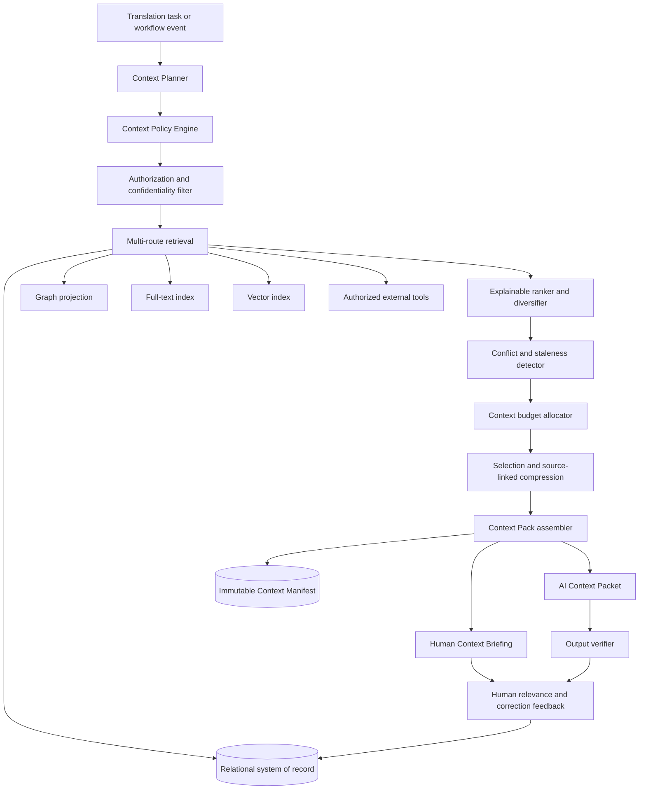

> **Authorship notice:** This document was generated by **OpenAI ChatGPT, GPT-5.6 Thinking**, on July 29, 2026. It extends the broader Bible-translation decision-support system design in this repository. The filename and metadata intentionally preserve provenance so human and AI collaborators can identify its source.

# 1. Executive synthesis

Context engineering should be treated as a first-class subsystem of the proposed Bible-translation decision-support platform.

The platform's knowledge graph, decision records, linguistic resources, Scripture text, project policies, translation notes, community feedback, and prior precedents are not automatically useful merely because they exist in a database. They become useful only when the system can determine:

- Which information is relevant to the present task
- Which information is authoritative, advisory, disputed, stale, or unverified
- Which version of each item applies
- Which user or AI process is permitted to see it
- What must be included and what should be omitted
- How much detail is appropriate
- How the information should be ordered and formatted
- What contradictions or uncertainties must be surfaced
- What evidence supports each contextual claim
- How the exact context package can later be reproduced and audited

This document proposes the following definition for the product:

> **Context engineering is the policy-governed process of capturing, classifying, retrieving, selecting, organizing, compressing, isolating, presenting, versioning, and evaluating the information and capabilities needed by a human or AI actor to perform a specific translation task responsibly.**

This is broader than prompt engineering. Prompt engineering concerns how instructions are expressed to a model. Context engineering governs the entire informational environment in which the model—or the translator—works.

The central product recommendation is to build a **Context Engine** that produces a versioned **Context Pack** for every significant translation task.

A Context Pack should have two coordinated representations:

1. **AI Context Packet:** a bounded, machine-readable package assembled for a particular model call or agent step.
2. **Human Context Briefing:** a transparent, navigable presentation of the same evidence, decisions, conflicts, and omissions for translators and reviewers.

Every AI-assisted action should also create a **Context Manifest** recording exactly what the AI received, why it was selected, which items were withheld, and which policies governed the assembly. This makes AI behavior reproducible and gives human translators a way to inspect the basis of an answer rather than receiving an opaque recommendation.

The strongest formulation of the product thesis is therefore:

> **The software is not merely a database of translation decisions. It is a context-engineering system that converts reviewed translation knowledge into task-specific, explainable, permission-aware working context for both people and AI.**

# 2. What context engineering is—and is not

## 2.1 Industry definitions

Anthropic describes context engineering as the practice of curating and maintaining the optimal set of information supplied during model inference, including instructions, tools, external data, message history, and other state. Anthropic emphasizes that context is finite and that the goal is not maximum context, but the smallest high-signal set that supports the desired behavior.[^anthropic-context]

LangChain defines context engineering as building dynamic systems that provide the right information and tools, in the right format, so that an AI application can accomplish a task. Its framework distinguishes model context, tool context, and lifecycle context, as well as transient runtime state and persistent cross-session stores.[^langchain-context]

OpenAI's description of its internal data agent illustrates a layered context system combining structural metadata, human annotations, code-derived knowledge, institutional documentation, memory, live runtime inspection, permissions, and retrieval.[^openai-data-agent] OpenAI's discussion of long-running coding agents similarly argues for giving agents a concise map to structured sources of truth rather than a monolithic instruction manual.[^openai-harness]

These sources are implementation guidance rather than settled scientific definitions. Nevertheless, they converge on a useful idea: **reliable AI behavior depends less on a single clever prompt than on governing the complete, changing information state available at each step.**

## 2.2 Context engineering versus adjacent concepts

| Concept | Primary concern | Relationship to context engineering |
|---|---|---|
| Prompt engineering | Wording and structure of model instructions | One component of context engineering |
| Retrieval-augmented generation | Retrieving external information for generation | One context-selection mechanism |
| Knowledge graph | Structured entities and relationships | A source from which context is assembled |
| Vector database | Similarity-based candidate retrieval | One retrieval mechanism, not the context system |
| Memory | Persistent information retained across sessions | A context source requiring write, update, trust, and deletion policies |
| Workflow engine | State transitions and deterministic process | Determines when context is needed and what actions are permitted |
| Agent orchestration | Model-directed or code-directed multi-step execution | Consumes and changes context over time |
| Tool design | Interfaces through which models retrieve data or take action | Controls the model's capability context |
| User interface | What people see and manipulate | The human-facing context environment |
| Translation memory | Previously translated segments and matches | A narrow precedent/context source |
| Decision-support system | Helps people analyze and decide | The broader product category enabled by context engineering |

## 2.3 What context engineering must not become

It should not become:

- A mechanism for dumping every available resource into a model context window
- A hidden prompt layer that translators cannot inspect
- A way to make external precedents appear locally authoritative
- A substitute for source criticism, discourse analysis, community testing, or consultant review
- An excuse to store every AI interaction as permanent memory
- A method for silently steering teams toward one theology or translation philosophy
- A ranking score that hides uncertainty and disagreement
- A generic chatbot wrapper around project files

# 3. Research basis and implications

## 3.1 More context is not automatically better

Long context windows do not guarantee reliable use of all included information. The study *Lost in the Middle* found that model performance varied according to where relevant evidence appeared in long input contexts, with information in the middle often used less reliably.[^lost-middle] Later work continues to find that long-context methods vary significantly by task and dependency structure.[^lost-decomposition]

**Product implication:** The platform should never equate “available to the model” with “reliably considered by the model.” Important constraints and evidence must be deliberately selected, organized, and tested.

## 3.2 Context should be retrieved just in time

Anthropic recommends combining small amounts of stable context loaded up front with tools that retrieve more detailed context only when needed. It describes four recurring strategies: writing context outside the window, selecting relevant context, compressing context, and isolating context.[^anthropic-context][^langchain-blog]

**Product implication:** The AI should receive a concise task packet and stable project rules, then retrieve deeper passage, lexical, discourse, precedent, or target-language information through focused tools.

## 3.3 Human annotations contribute knowledge that structure alone cannot supply

OpenAI's internal data-agent architecture combines machine-readable schemas with human annotations that explain intent, meaning, caveats, and organizational practice.[^openai-data-agent]

**Product implication:** Morphological tags, graph edges, and metadata cannot replace translator and community knowledge. The system must preserve human explanations of why a target-language form is natural, sensitive, ambiguous, rejected, prestigious, stigmatized, or appropriate only in a particular setting.

## 3.4 Context must remain structured around the document and discourse

Document-level machine-translation research shows that broader context can improve some discourse phenomena, but gains are not automatic and very long undifferentiated context may not help.[^docmt-public][^when-context-useful] Research has also explored discourse structure rather than merely fixed windows of surrounding sentences.[^discourse-docmt]

**Product implication:** Passage context should be selected by discourse unit, participant structure, rhetorical relation, quotation frame, or other meaningful organization—not solely by an arbitrary number of verses before and after the current verse.

## 3.5 Bible translation requires human authority and local ownership

Current Bible-translation discussions include both positive findings about AI assistance and substantial concerns about exegetical error, naturalness, translator formation, community ownership, and the privilege of first draft.[^ai-drafts-study][^privilege-first-draft][^human-centered-ethics] Context engineering should therefore be designed to **empower human interpretation and review**, not merely to increase automated drafting throughput.

**Product implication:** The highest-value initial applications are likely to be contextual research, precedent retrieval, consistency checking, dependency analysis, decision documentation, and review preparation—not autonomous final rendering.

# 4. Context-engineering principles for this system

The Context Engine should optimize for the following properties.

## 4.1 Relevance

Include information that can materially affect the present task. Do not include information merely because it shares words, labels, or a nearby reference.

## 4.2 Sufficiency

The context must contain enough information to support the requested analysis. Minimality must not become omission of necessary evidence.

## 4.3 Authority

The package must distinguish:

- Project policy
- Approved local decision
- Provisional local decision
- Consultant recommendation
- Community observation
- Imported external precedent
- Published scholarly argument
- Deterministic system result
- AI-generated suggestion

## 4.4 Provenance

Every substantive item should retain its author, source, version, date, evidence links, import path, and review state.

## 4.5 Freshness and temporal validity

The system must know whether an item is current, superseded, historically relevant, or awaiting revalidation.

## 4.6 Scope

A decision may apply to:

- One token
- One verse
- One discourse unit
- One book
- A genre
- The entire project
- One medium
- One audience
- One dialect or community

Context must not silently expand beyond the decision's approved scope.

## 4.7 Permission and confidentiality

Authorization must be applied before retrieval, ranking, summarization, embedding results, or cross-project comparison.

## 4.8 Economy

Every token and interface element should earn its place. Context should be sufficient but not indiscriminate.

## 4.9 Explainability

The system should explain why each major contextual item was selected and why other plausible items were omitted or down-ranked.

## 4.10 Contestability

Translators must be able to reject, distinguish, correct, hide, or replace context without fighting the system.

## 4.11 Reproducibility

A prior AI output should be reproducible from its model configuration, task instructions, tool results, Context Manifest, and source revisions.

## 4.12 Human parity

The human user should be able to inspect the important context available to the AI. The AI should not operate from a hidden body of project knowledge that the translator cannot review.

# 5. Context taxonomy

The system should maintain typed context rather than one undifferentiated document store.

| Context layer | Examples | Typical authority | Persistence | Primary use |
|---|---|---:|---:|---|
| **Task context** | Current question, requested operation, current workflow state | User or workflow | One task | Defines the immediate objective |
| **Scripture context** | Source text, target draft, textual variants, verse and span anchors | Edition/project dependent | Versioned | Grounds the case in the text |
| **Literary and discourse context** | Discourse unit, participants, topic/focus, rhetorical relation, quotation structure | Reviewed analysis | Versioned | Prevents isolated verse reasoning |
| **Lexical and semantic context** | Lemma, sense, semantic domain, key-term history, collocations | Mixed | Versioned | Supports lexical and key-term decisions |
| **Target-language context** | Grammar, lexicon, corpus examples, register, idiom, honorifics, community judgments | Local experts and evidence | Long term | Grounds naturalness and acceptability |
| **Cultural and sociolinguistic context** | Cultural assumptions, taboo, dialect, prestige, identity, audience | Community/local experts | Time-sensitive | Prevents decontextualized recommendations |
| **Project-governance context** | Translation brief, philosophy, policies, approval rules, scope | Project authority | Long term | Constrains acceptable recommendations |
| **Decision context** | Prior cases, alternatives, rationales, exceptions, supersession | Varies by status | Long term | Enables precedent and consistency |
| **Dependency context** | Unfulfilled prerequisites, blocking policies, downstream cases | Deterministic graph plus review | Dynamic | Controls readiness and impact |
| **Evidence context** | Lexicons, grammars, corpora, commentaries, testing results | Source dependent | Versioned | Supports claims and review |
| **Workflow context** | Assignment, review stage, required reviewers, deadlines | Deterministic system | Dynamic | Determines permissible next actions |
| **User and role context** | Role, expertise, language, permissions, presentation preferences | Organization/project | Session and long term | Personalizes access and display |
| **Tool context** | Available retrieval tools, schemas, action limits | System | Runtime | Defines AI capabilities |
| **Temporal context** | Current text revision, effective policy dates, superseded versions | Deterministic system | Long term | Prevents stale application |
| **Trust context** | Verification, confidence, authorship class, source reliability | System plus humans | Long term | Calibrates reliance |
| **Negative context** | Rejected precedents, prohibited sources, known false cognates, invalid assumptions | Human reviewed | Long term | Prevents repeated mistakes |
| **Interaction context** | Recent conversation, tool results, open subquestions | Runtime | Short term | Maintains task continuity |

## 5.1 Negative context is essential

Most systems store what should be remembered but not what should be avoided. This platform should preserve:

- A precedent that looked similar but was distinguished
- A lexical sense that was investigated and rejected
- A source that is not licensed for the project
- A rendering that caused community misunderstanding
- An AI inference that reviewers found unsupported
- A project policy that has been superseded
- A related-language form known to be a false friend

Negative context prevents teams and AI systems from repeatedly reopening settled dead ends.

# 6. The context lifecycle


## 6.1 Capture

Context enters through:

- Translator-created decision cases
- Paratext notes and Biblical Terms data
- Scripture text and annotations
- FLEx or LIFT lexical data
- Corpus examples
- Consultant comments
- Community-testing records
- Oral or signed-media annotations
- Imported external precedents
- AI suggestions awaiting review
- Deterministic checks and graph analysis

## 6.2 Normalize

Imported content should be converted into typed, anchored records while preserving the original artifact.

Normalization must never erase:

- Original wording
- Source revision
- Authorship
- Uncertainty
- Dissent
- Licensing restrictions
- Community restrictions

## 6.3 Classify

Each item should receive explicit metadata for:

- Authority class
- Review status
- Scope
- Confidence
- Sensitivity
- Project ownership
- Validity period
- Medium
- Language variety
- Evidence support

## 6.4 Retrieve

Candidate generation should combine:

- Exact Scripture and token anchors
- Graph traversal
- Lexeme and sense matches
- Project-policy application
- Full-text retrieval
- BM25 or equivalent lexical retrieval
- Vector retrieval
- Target-language feature matching
- Dependency overlap
- Human-curated links

## 6.5 Assemble

The assembler should distinguish mandatory context from optional candidate context.

Mandatory context may include:

- The current source and target spans
- The current project policy
- The current decision state
- Unfulfilled hard dependencies
- Applicable confidentiality rules
- Required output schema

Optional context may include:

- Related precedents
- Commentary excerpts
- Corpus examples
- Cross-language comparisons
- Historical versions

## 6.6 Evaluate

Every Context Pack should be evaluated not only by whether the resulting answer was accepted, but by whether the package was:

- Relevant
- Complete enough
- Correctly authorized
- Properly sourced
- Fresh
- Balanced
- Economical
- Understandable

# 7. The Context Pack

## 7.1 AI Context Packet

A model-facing packet should use typed sections rather than a prose dump.

```yaml
context_packet:
  task:
    task_type: compare_translation_options
    case_id: case:1co-7-1-quotation
    requested_output_schema: translation_option_comparison:v1

  authority_and_constraints:
    human_authority: final
    project_policies:
      - policy:unmarked-quotations:v3
    prohibited_actions:
      - approve_decision
      - edit_approved_scripture
      - infer_unattested_target_language_facts

  current_text:
    source_revision: grc-source:2026-01
    target_revision: project-draft:1842
    anchors:
      - 1CO 7:1

  observations:
    verified: []
    provisional: []
    ai_suggested: []

  dependencies:
    hard_unfulfilled: []
    soft_unfulfilled: []

  precedents:
    - case_id: case:1co-6-12-slogan
      disposition: candidate
      authority: same_project_approved
      why_retrieved:
        - same_book
        - similar_proposition_response_pattern

  evidence:
    - source_id: evidence:commentary-17
      permitted_excerpt_id: excerpt:991
      trust: published_secondary_source

  contradictions:
    - conflict_id: conflict:44
      description: approved project punctuation policy conflicts with one external precedent

  omissions:
    - source_type: protected_resource
      reason: current_user_not_authorized

  output_requirements:
    cite_every_substantive_claim: true
    distinguish_observation_from_inference: true
    list_reasons_precedent_may_not_apply: true
```

## 7.2 Human Context Briefing

The human-facing version should not imitate an AI prompt. It should present a useful research workspace:

- **Current question**
- **Current text and revision**
- **What the project has already decided**
- **What remains unresolved**
- **Relevant evidence**
- **Potential precedents and why they were shown**
- **Reasons each precedent may not apply**
- **Dependencies and blockers**
- **Conflicts and dissent**
- **Suggested next research actions**
- **What the AI was allowed to do**
- **What information was omitted and why**

## 7.3 Context Manifest

A Context Manifest is an immutable record of an assembled Context Pack.

```json
{
  "manifestId": "ctxm:2026-07-29:000184",
  "projectId": "project:demo-1co",
  "caseId": "case:1co-7-1-quotation",
  "taskType": "compareTranslationOptions",
  "createdAt": "2026-07-29T20:42:13Z",
  "createdFor": {
    "actorType": "aiModel",
    "actorId": "model:gpt-example",
    "userId": "user:translator-7"
  },
  "policyVersion": "context-policy:translation-analysis:v4",
  "sourceRevisions": [
    "grc-source:2026-01",
    "project-draft:1842",
    "policy:unmarked-quotations:v3"
  ],
  "includedItems": [
    {
      "contextItemId": "context:441",
      "reason": "mandatory_current_source_span",
      "authority": "source_text",
      "tokenCost": 128
    }
  ],
  "excludedItems": [
    {
      "contextItemId": "context:902",
      "reason": "superseded"
    },
    {
      "contextItemId": "context:1182",
      "reason": "permission_denied"
    }
  ],
  "retrievalRunIds": ["retrieval:8817"],
  "compressionArtifacts": ["summary:774"],
  "estimatedTokenCount": 7342,
  "contentHash": "sha256:..."
}
```

# 8. Where context engineering should be used in the translation workflow

## 8.1 Creating a translation question

### Context needed

- Current Scripture span
- Target draft revision
- Open notes on the span
- Existing cases already anchored there
- Project stage
- User role

### AI assistance

- Suggest a concise issue statement
- Separate observations from interpretations
- Detect a possible duplicate case
- Suggest decision category
- Suggest likely dependencies

### Human empowerment

The interface should show the translator what prior work already exists before asking them to complete a large form.

### Deterministic controls

- Prevent duplicate anchor/version mistakes
- Preserve exact text revision
- Record author and creation event

## 8.2 Exegetical and source-language research

### Context needed

- Source text and morphology
- Relevant textual variants
- Immediate and discourse context
- Lexical senses and constructions
- Authorized resources
- Existing project assumptions

### AI assistance

- Assemble an evidence briefing
- Compare scholarly arguments
- Identify where sources agree or disagree
- Draft questions for further investigation
- Cite source identifiers

### Human empowerment

Instead of presenting a synthesized conclusion first, the interface should let translators inspect the evidence map and choose which interpretive questions deserve attention.

### Safeguard

AI summaries must never replace licensed source content or conceal disagreement among sources.

## 8.3 Key-term work

### Context needed

- Source lemma and sense
- Occurrences grouped by sense and discourse function
- Current target renderings
- Approved term policy
- Community testing
- Morphological and collocational constraints
- Related decisions and exceptions

### AI assistance

- Retrieve comparable occurrences
- Detect unexplained variation
- Group contexts by possible sense
- Compare candidate target terms
- Flag places where a precedent may not apply

### Human empowerment

Provide a key-term Context Pack that organizes occurrences into meaningful clusters rather than presenting a flat concordance.

## 8.4 Participant reference and discourse analysis

### Context needed

- Discourse-unit boundaries
- Participant inventory
- Referential chains
- Current translation forms
- Target-language reference strategy
- Prominence and topic shifts
- Prior participant-reference cases

### AI assistance

- Suggest possible referential links
- Identify ambiguous pronouns
- Surface project policy
- Compare parallel discourse patterns

### Human empowerment

Display a participant map and let translators correct referential chains before any consistency recommendation is made.

## 8.5 Comparing alternative renderings

### Context needed

- Explicit interpretation represented by each rendering
- Target-language naturalness evidence
- Project constraints
- Audience and medium
- Prior similar alternatives
- Known risks

### AI assistance

- Produce a side-by-side consequences analysis
- Identify implicit interpretive commitments
- Draft comprehension-testing questions
- Identify what evidence would discriminate among options

### Human empowerment

The comparison should clarify tradeoffs without ranking an option unless the user requests a recommendation and the evidence warrants one.

## 8.6 Making a provisional decision

### Context needed

- All required evidence classes
- Open dissent
- Unfulfilled dependencies
- Approval requirements
- Applicable precedents and exceptions

### AI assistance

- Draft the rationale
- Identify unsupported claims
- Check whether the proposed scope is too broad
- Suggest confidence and risk questions

### Deterministic controls

- AI cannot approve
- Hard unmet dependencies block final approval
- Required reviewer roles are computed from policy

## 8.7 Precedent retrieval

### Context needed

- Current case features
- Same-project decisions
- Project policies
- Candidate cross-project cases within permission boundaries
- Human feedback on prior retrievals

### AI assistance

- Explain similarities and distinguishing characteristics
- Suggest missing relevance dimensions
- Summarize only from verified case data

### Human empowerment

Each result should have:

- Why it was shown
- Authority badge
- Scope
- Status
- Relevant similarities
- Important differences
- “Apply,” “adapt,” “distinguish,” and “not relevant” actions

## 8.8 Dependency resolution

### Context needed

- Dependency rule
- Required entity and state
- Existing evidence
- Current workflow state
- Waiver policy

### AI assistance

- Suggest evidence that may satisfy the dependency
- Explain why it remains unresolved
- Draft a research plan

### Deterministic controls

Fulfillment is calculated from explicit state and rules. AI interpretation cannot silently mark a dependency fulfilled.

## 8.9 Consultant or peer review

### Context needed

- The exact decision version under review
- Source and target revision
- Rationale
- Alternatives
- Evidence
- AI involvement
- Dissent
- Downstream impact

### AI assistance

- Build a review briefing
- Detect incomplete citations
- Highlight changes since the prior review
- Suggest review questions

### Human empowerment

Consultants should not have to reconstruct the history from a long thread. The Context Pack should summarize the case while retaining direct access to original evidence.

## 8.10 Community testing

### Context needed

- Plain-language issue
- Approved test alternatives
- Audience profile
- Sensitive information policy
- Prior testing results
- Medium-specific artifact

### AI assistance

- Draft neutral testing questions
- Translate technical rationale into plain language
- Summarize responses without erasing minority views

### Safeguard

Do not expose confidential scholarly or internal disagreement unnecessarily. The community-facing Context Pack should be purpose-built, not a simplified dump of the consultant packet.

## 8.11 Consistency checking

### Context needed

- Approved policies
- Decision scope
- Current text corpus
- Explicit exceptions
- Relevant senses and discourse functions

### AI assistance

- Flag unexplained inconsistency
- Explain why a difference may be legitimate
- Cluster potential violations

### Deterministic controls

Exact policy checks should use code and graph queries. AI should be reserved for contextual distinctions and explanations.

## 8.12 Change impact

### Context needed

- Old and new decision versions
- Direct and transitive dependents
- Text spans implemented under each version
- Review status
- Exceptions

### AI assistance

- Summarize likely impact
- Group affected cases by type
- Draft reviewer briefings

### Deterministic controls

The impact set is computed from explicit relationships. Approved text is never silently changed.

## 8.13 Work prioritization

### Context needed

- Dependency graph
- Downstream value
- Risk
- Effort estimates
- Team availability
- Community priorities
- Milestones
- Neglect constraints

### AI assistance

- Explain prioritization tradeoffs
- Compare possible work sequences
- Identify missing effort or risk data

### Human empowerment

Recommendations should show why a task is high leverage and what would be neglected by selecting it.

## 8.14 Cross-project and cross-language precedent

### Context needed

- Explicit transfer warrant
- Shared linguistic or sociolinguistic characteristic
- Local authority status
- Permissions
- Version compatibility
- Known differences

### AI assistance

- Identify possible analogies
- Draft the transfer warrant
- List reasons not to transfer the solution

### Safeguard

External cases are informative, not authoritative. Genealogical relationship alone is insufficient context.

## 8.15 Oral and signed-language translation

### Context needed

- Exact media version
- Timecode or region anchors
- Semantic Scripture anchor
- Prosody, nonmanual features, signer/speaker information
- Community and consultant review
- Consent and access restrictions

### AI assistance

- Retrieve related media evidence
- Compare annotated segments
- Draft a multimodal review packet
- Suggest where physical anchors may have shifted after editing

### Deterministic controls

Annotations must remain tied to immutable media versions. Context assembly must never show a review comment against the wrong recording or video revision.

# 9. Retrieval and context selection architecture

## 9.1 Retrieval should be hybrid

No single retrieval method is adequate.

### Symbolic retrieval

Best for:

- Scripture references
- Exact lexemes and senses
- Policies
- Decision status
- Dependencies
- Versions
- User permissions

### Graph retrieval

Best for:

- Precedent paths
- Shared dependencies
- Impact analysis
- Policy application
- Exceptions
- Participant and discourse relationships

### Lexical retrieval

BM25-style retrieval is useful for:

- Exact terminology
- Names
- Rare expressions
- Quoted phrases
- Resource titles

### Vector retrieval

Useful for candidate discovery when cases express similar problems using different wording.

Vector similarity should not establish authority, applicability, or dependency fulfillment.

### Human-curated retrieval

Manual links should receive strong consideration, but their status and author must remain visible.

## 9.2 Contextualized indexing

A chunk such as “This rendering was rejected” is useless without context. Index entries should carry a compact contextual header:

```text
Project: Demo Corinthians
Case: Speaker status in 1 Corinthians 7:1
Entity type: Rejected option
Option: Treat clause as unqualified Pauline assertion
Reason: Following discourse and project quotation policy
Status: Reviewed; not selected
```

Anthropic's contextual-retrieval work similarly argues that retrieval chunks lose meaning when separated from their document context and proposes adding chunk-specific context before indexing.[^contextual-retrieval]

## 9.3 Mandatory versus retrieved context

The engine should begin with a deterministic mandatory set, then add ranked candidates.

```pseudo
mandatory = policyEngine.requiredContext(task, case, user)

candidates = union(
    symbolicRetrieve(task, case),
    graphRetrieve(task, case),
    lexicalRetrieve(task, case),
    vectorRetrieve(task, case),
    curatedLinks(case)
)

permitted = authorizationFilter(candidates, user)
valid = temporalAndStatusFilter(permitted)
ranked = explainableRank(valid, task)
diversified = diversifyBySourceAndReason(ranked)
selected = budgetAllocator(mandatory, diversified)

return assemble(mandatory, selected)
```

## 9.4 Explainable ranking

A conceptual ranking model is:

```text
candidate utility =
    eligibility
    × task relevance
    × authority compatibility
    × evidence quality
    × temporal validity
    × scope compatibility
    × diversity contribution
    × confidence
```

The product should expose the major dimensions rather than display only a score.

## 9.5 Query decomposition

A complex question should generate multiple retrieval routes.

Example: “Should this pronoun be explicit?” may require separate searches for:

- Source-language reference ambiguity
- Target-language pronoun omission rules
- Participant prominence
- Project participant-reference policy
- Similar cases in the same discourse unit
- Community-testing results

One embedding query should not be expected to retrieve all of these.

# 10. Context budgets, ordering, and compression

## 10.1 Budget allocation

Allocate context by function rather than filling the window until a token limit is reached.

Example budget categories:

- Governance and safety
- Current task and text
- Mandatory project context
- Target-language context
- Precedents
- Evidence
- Counterevidence and dissent
- Tool schemas
- Output schema

The budget should vary by task. A consistency check needs more project policy and corpus data; a discourse-analysis task needs more passage structure; a community-review task needs less technical source-language content.

## 10.2 Ordering

Because long-context use can be position-sensitive, the package should:

- Put nonnegotiable authority and safety instructions in a clear opening section
- Keep the current task and exact Scripture span prominent
- Group evidence by claim or question
- Place contradictions next to the claims they challenge
- End with an explicit output contract and unresolved questions
- Avoid burying decisive policy among dozens of low-authority excerpts

Ordering must be empirically evaluated for each supported model rather than assumed universal.

## 10.3 Progressive disclosure

Do not preload entire lexicons, books, or project histories. Give the AI and human:

1. A concise map
2. High-priority context
3. References to deeper context
4. Tools or interface actions to expand it

## 10.4 Compression hierarchy

Prefer these methods in order:

1. Remove duplicate content
2. Remove obsolete tool output
3. Select smaller source spans
4. Use structured extraction
5. Use source-linked summaries
6. Use abstractive compression only when necessary

## 10.5 Compression safeguards

A compressed artifact must record:

- Source items
- Compression method
- Model or human author
- Date
- Intended task
- Omitted categories
- Confidence
- Whether dissent and uncertainty were preserved

An AI summary must never become the sole evidence for a translation decision.

# 11. Memory design

## 11.1 Memory types

| Memory type | Examples | Write policy | Retrieval use |
|---|---|---|---|
| **Working memory** | Current task, recent tool results, open questions | Automatic, short lived | Current model call or session |
| **Episodic memory** | A prior review session or research episode | Logged automatically; summarized cautiously | Reconstruct history |
| **Semantic project memory** | Approved policies, validated target-language facts | Human approval required | High-authority context |
| **Procedural memory** | How to perform a consultant review or key-term study | Project/admin approval | Workflow guidance |
| **Precedent memory** | Reviewed translation decision cases | Eligible by status and scope | Similar-case reasoning |
| **Negative memory** | Rejected assumptions, distinguished precedents | Human reviewed | Avoid repeated errors |
| **Personal memory** | User presentation preference or private note | User controlled | Personalization only |

## 11.2 Evidence before belief

The system should store immutable evidence before deriving reusable claims.

For example:

- Store the community-testing response artifact.
- Derive a structured observation from it.
- Have a human review the observation.
- Only then allow the observation to become project semantic memory.

This prevents an AI-generated interpretation of evidence from becoming indistinguishable from the evidence itself.

## 11.3 Memory write rules

AI may automatically write:

- Tool logs
- Retrieval traces
- Draft suggestions
- Temporary task notes

AI may propose but not automatically commit:

- Target-language facts
- Interpretive conclusions
- Precedent relationships
- Project policies
- Community preferences
- Evidence sufficiency judgments

## 11.4 Contradiction handling

When new context conflicts with existing memory, do not overwrite silently.

Create:

- A contradiction record
- Source links
- Affected scopes
- Review task
- Provisional retrieval policy

Until resolved, both views should be visible with status and authority.

# 12. Context isolation and specialized agents

## 12.1 Why isolate context

Large undifferentiated contexts increase distraction, leakage, and anchoring. Specialized processes can work with narrower evidence sets.

Possible specialist roles include:

- Source-text research
- Discourse analysis
- Target-language analysis
- Precedent retrieval
- Community-testing synthesis
- Consistency checking
- Change-impact analysis

## 12.2 Recommended initial architecture

Do not begin with a complex society of autonomous agents. Start with one orchestrator and focused, deterministic retrieval tools. Add specialist agents only when evaluations show a benefit.

## 12.3 Independent analysis to reduce anchoring

For high-risk cases, the system may ask separate agents—or separate human reviewers—to analyze:

- Source-text evidence
- Target-language evidence
- Precedent applicability

before exposing them to one another's conclusions. This can reduce premature convergence.

## 12.4 Sub-agent output contract

A specialist agent should return:

- Findings
- Evidence identifiers
- Confidence
- Unresolved questions
- Counterevidence
- Scope
- Context Manifest ID

It should not return an untraceable “expert answer.”

## 12.5 Isolation for confidentiality

A sub-agent working on one confidential project must not retrieve from another project unless explicit sharing policy permits it. Context isolation is therefore both a cognitive and a security boundary.

# 13. Model Context Protocol and tool design

The Model Context Protocol provides a standard way for AI applications to connect to external resources and tools.[^mcp-spec] It can be useful for integrating this system with Paratext, FLEx, corpora, Scripture resources, or other tools.

MCP should be treated as an **integration protocol**, not as the Context Engine itself.

## 13.1 Recommended tool namespaces

```text
scripture.get_passage_context
scripture.get_parallel_passages
source_language.get_analysis
terms.get_key_term_context
target_language.get_lexical_context
discourse.get_unit_context
decisions.search_precedents
decisions.get_case_context
dependencies.get_status
project.get_applicable_policies
evidence.fetch_authorized_excerpt
reviews.get_review_context
context.get_manifest
context.explain_selection
```

## 13.2 Tool-design principles

Anthropic's work on agent tools emphasizes clear purposes, limited overlap, meaningful compact results, and token-efficient responses.[^anthropic-tools]

Tools for this platform should:

- Return typed data
- Include source and version identifiers
- State authority and confidence
- Enforce permissions internally
- Return compact summaries plus expansion handles
- Distinguish data from instructions
- Avoid returning entire resources when a relevant span is sufficient
- Provide clear error semantics
- Be namespaced by domain

## 13.3 Tool discovery

Do not load hundreds of tool definitions into every model call. Select tool groups based on task type or allow controlled on-demand discovery.

## 13.4 Prompt-injection boundary

Imported notes, webpages, documents, and external precedents are **data**, not instructions. Tool outputs should label untrusted text and prevent it from being merged into system instructions.

# 14. Human context engineering

Context engineering should improve the work of human translators even when no AI model is called.

## 14.1 Human Context Packs

### Passage briefing

- Discourse unit
- Participants
- Open questions
- Key terms
- Applicable project policies
- Relevant prior cases
- Pending checks

### Decision briefing

- Issue
- Alternatives
- Evidence
- Precedents
- Dependencies
- Dissent
- Current status

### Consultant briefing

- Changes since last review
- High-risk assumptions
- AI involvement
- Missing evidence
- Downstream impact

### Community-review briefing

- Plain-language issue
- Approved alternatives
- Neutral testing questions
- Media artifact
- Consent and privacy instructions

### Project-management briefing

- Blocking decisions
- High-impact unresolved work
- Review capacity
- Risks and neglected areas

## 14.2 “Why am I seeing this?”

Every retrieved item should have an explanation such as:

> Shown because it is an approved decision in the same project, concerns the same discourse construction, and shares the same target-language quotation strategy.

## 14.3 Authority badges

Use clear labels:

- Project policy
- Approved local precedent
- Provisional local case
- External informative case
- Consultant opinion
- Community evidence
- AI suggestion
- Deterministic check
- Superseded historical record

## 14.4 Visible omissions

The user should be told when potentially relevant context is unavailable because:

- Permission is lacking
- The resource is not licensed
- The record is superseded
- The system could not resolve its version
- Retrieval confidence is too low

This prevents an apparently complete briefing from creating false confidence.

## 14.5 User control

Translators should be able to:

- Pin context
- Hide context
- Mark it irrelevant
- Correct classification
- Add a distinguishing characteristic
- Request broader or narrower retrieval
- Compare the raw source to the summary
- Save a Context Pack for review

# 15. Worked example: 1 Corinthians 7:1

This example extends the speaker-attribution case from the broader system document. It does not assert a universally correct interpretation or rendering.

## 15.1 Task

> Compare the consequences of treating the clause in 1 Corinthians 7:1b as Paul's statement, a Corinthian slogan, or deliberately ambiguous discourse.

## 15.2 Context-planning step

The Context Engine decomposes the task into context needs:

1. Exact source and target spans
2. Letter and discourse context
3. Project quotation policy
4. Candidate precedents in 1 Corinthians
5. Target-language quotation and reported-speech strategies
6. Oral-medium implications
7. Relevant scholarly evidence
8. Current dependencies and review requirements

## 15.3 Mandatory context

- Current Greek source revision
- Current project draft
- 1 Corinthians 7:1–7 discourse unit
- Project policy for unmarked quotation
- Human authority policy
- Current case status
- Hard dependencies

## 15.4 Retrieved candidate context

- 1 Corinthians 6:12 case
- 1 Corinthians 10:23 case
- Other possible slogan cases in the same project
- Target-language examples of reported propositions
- Community-testing results for quotation cues
- Authorized scholarly discussions

## 15.5 Context that should not be included automatically

- Every occurrence of “good” in the New Testament
- All project notes for 1 Corinthians
- Unreviewed external translations without explanation
- Similarity matches based only on English wording
- Protected commentary content beyond authorized excerpts
- A related-language punctuation policy with no target-language transfer warrant

## 15.6 AI task contract

The AI may:

- Summarize evidence
- Compare alternatives
- Identify assumptions
- Explain why precedents may apply or fail
- Suggest further research

The AI may not:

- Decide the final speaker attribution
- Mark a dependency fulfilled
- approve the decision
- silently change quotation punctuation
- present an external translation as authority

## 15.7 Human briefing

The translator sees:

- A compact issue statement
- The source and target text
- Three alternatives
- The project quotation policy
- Two precedent cards
- A “differences that matter” section
- The oral-rendering dependency
- Scholarly disagreement
- An action to request consultant review

## 15.8 Reproducibility

The resulting AI comparison links to the Context Manifest. A later reviewer can inspect:

- Which text revision was used
- Which precedents appeared
- Which sources were quoted
- Which items were excluded
- Which model and prompt version generated the comparison
- Which translator edits changed the AI draft

# 16. Technical architecture



## 16.1 Core entities

### `context_items`

Represents something that may be supplied as context.

```text
id
project_id
item_type
source_entity_type
source_entity_id
source_revision_id
title
content_or_reference
scope_json
authority_class
trust_status
confidence
sensitivity_class
valid_from
valid_until
superseded_by
created_at
```

### `context_policies`

Defines what context is required, allowed, prioritized, or prohibited for a task.

```text
id
project_id
task_type
policy_version
mandatory_rules_json
retrieval_rules_json
budget_rules_json
compression_rules_json
model_permissions_json
human_display_rules_json
```

### `context_manifests`

Records a complete context assembly event.

```text
id
project_id
case_id
task_type
user_id
actor_type
actor_id
policy_version
model_config_id
content_hash
token_estimate
created_at
```

### `context_manifest_items`

```text
manifest_id
context_item_id
disposition          # included, excluded, summarized, available_on_demand
selection_reason
rank_components_json
position
rendering_mode
source_hash
```

### `context_summaries`

```text
id
source_item_ids
summary_text
summary_schema
method
model_or_user_id
intended_task_type
preserved_uncertainties_json
created_at
```

### `retrieval_runs`

```text
id
manifest_id
query_route
query_payload
candidate_ids
ranking_config
latency_ms
created_at
```

### `context_feedback`

```text
id
manifest_id
context_item_id
user_id
feedback_type        # relevant, irrelevant, misleading, missing, stale, unauthorized
explanation
created_at
```

## 16.2 Relationship to the decision model

Most context should reference existing domain entities rather than duplicate them.

Examples:

- A `DecisionVersion` becomes a `context_item` by reference.
- An `EvidenceItem` becomes a source-linked context item.
- A `Dependency` is evaluated directly and rendered into the pack.
- A `PrecedentLink` supplies retrieval and explanation features.
- A `Review` is included according to role and scope.

## 16.3 Representative APIs

```text
POST /context/plan
POST /context/packs
GET  /context/packs/{manifestId}
GET  /context/packs/{manifestId}/human
GET  /context/packs/{manifestId}/model
GET  /context/packs/{manifestId}/explain
POST /context/packs/{manifestId}/feedback
POST /context/items/{itemId}/pin
POST /context/items/{itemId}/mark-stale
GET  /cases/{caseId}/context-preview
GET  /tasks/{taskType}/context-policy
POST /context/evals/run
```

## 16.4 Context policy example

```json
{
  "taskType": "suggestPrecedents",
  "mandatory": [
    "current_case",
    "current_project_policy",
    "current_source_revision",
    "access_policy"
  ],
  "candidateRoutes": [
    "same_project_graph",
    "same_lemma_and_sense",
    "same_discourse_feature",
    "shared_dependency",
    "vector_case_similarity"
  ],
  "exclude": [
    "withdrawn_decisions",
    "unauthorized_projects",
    "unverified_ai_memories"
  ],
  "requirements": {
    "showDistinguishingFactors": true,
    "showAuthority": true,
    "showSourceVersion": true,
    "maximumCandidates": 10
  }
}
```

# 17. Security, privacy, and ethical safeguards

## 17.1 Authorization before retrieval

Do not retrieve first and redact later. Unauthorized records must not enter candidate lists, embeddings returned to the task, logs visible to the user, or model context.

## 17.2 Context poisoning

A malicious or mistaken note could influence future AI behavior if stored as memory. Mitigations include:

- Authorship and trust labels
- Human approval for semantic memory
- Separation of evidence from derived claims
- Conflict detection
- Ability to quarantine a source
- Audit of what outputs consumed the poisoned item

## 17.3 Instruction injection

External resources may contain text that looks like an instruction. The system must:

- Label external content as data
- Keep system instructions separate
- Prevent tools from modifying context policies
- Sanitize unsafe markup where necessary
- Require confirmation before sensitive actions

## 17.4 Authority laundering

AI summaries can accidentally make low-authority claims sound official. Every summarized claim must retain authority and provenance labels.

## 17.5 Cross-project leakage

Separate:

- Storage
- Search indexes
- Embedding namespaces
- Cache entries
- Logs
- Evaluation datasets

where project policy requires isolation.

## 17.6 Theological and translation-philosophy bias

The Context Pack should disclose:

- Applicable project translation brief
- Source traditions represented
- Competing interpretations
- Whether a recommendation depends on a particular theological assumption

The system must not encode one translation philosophy as an invisible universal default.

## 17.7 Community consent

Context about cultural practices, community attitudes, signed-language performers, or sensitive sociolinguistic conditions may require restrictions beyond ordinary project access. Consent should govern storage, AI-provider exposure, cross-project reuse, and publication.

# 18. Evaluation framework

Context engineering must be evaluated independently from model quality.

## 18.1 Golden Context Set

For a curated set of translation tasks, expert reviewers should identify:

- Mandatory context
- Useful optional context
- Misleading context
- Prohibited context
- Important conflicts
- Acceptable omissions

This creates a benchmark for the Context Engine.

## 18.2 Context-selection metrics

- Precision of selected context
- Recall of required context
- Recall of counterevidence
- Authority-class accuracy
- Freshness accuracy
- Permission compliance
- Source-version accuracy
- Misleading-context rate
- Context diversity
- Token cost
- Latency

## 18.3 Output-grounding metrics

- Citation precision
- Citation completeness
- Entailment of claims by cited evidence
- Correct distinction between fact, interpretation, and suggestion
- Unsupported-claim rate
- Correct use of project policy
- Correct handling of superseded decisions

## 18.4 Human-centered metrics

- Time to understand the issue
- Time to locate evidence
- Time to review an AI recommendation
- Ability to explain why a precedent was shown
- Ability to detect a misleading precedent
- Cognitive workload
- Trust calibration
- Frequency of context overrides
- Documentation burden

## 18.5 Ablation conditions

Compare:

1. Model with only the current prompt
2. Model with current passage only
3. Model with an indiscriminate long context dump
4. Model with keyword retrieval
5. Model with vector retrieval
6. Model with hybrid retrieval
7. Model with the full policy-driven Context Pack
8. Human without Context Pack
9. Human with Context Pack but no AI
10. Human with Context Pack and AI

This design can determine whether value comes from the AI, the structured human briefing, or both.

## 18.6 Failure taxonomy

- Required context omitted
- Irrelevant context included
- Correct context down-ranked
- Stale context used
- Wrong scope applied
- Low-authority item treated as policy
- Contradiction hidden
- Summary distorted source
- Permission boundary crossed
- Context too large for reliable use
- AI ignored context
- Human misunderstood authority

## 18.7 Release gates

An AI feature should not ship merely because users like its answers. It should meet minimum thresholds for:

- Required-context recall
- Permission compliance
- Citation faithfulness
- Stale-context avoidance
- Human ability to understand the basis of recommendations

# 19. MVP: Context Pack Builder

The first context-engineering prototype should be a **Context Pack Builder**, not a general autonomous translation agent.

## 19.1 In scope

- One project
- One biblical book or bounded corpus
- Current Scripture span
- Project policies
- Structured decision cases
- Dependencies
- Same-project precedent retrieval
- Source-linked evidence
- Human Context Briefing
- AI Context Packet
- Context Manifest
- Relevance feedback
- Basic token budgeting

## 19.2 Explicitly out of scope

- Autonomous drafting of final Scripture
- Automatic approval
- Unrestricted cross-project retrieval
- Self-modifying memory policies
- Fully autonomous multi-agent orchestration
- Automatic cultural conclusions
- Universal context ranking across all project types
- Silent application of decisions to the text

## 19.3 Prototype screens

1. **Context Preview** — shows what will be supplied before an AI action
2. **Passage Context Pack** — human briefing for the current passage
3. **Precedent Results** — reasons, authority, similarities, distinctions
4. **Context Manifest Inspector** — exact AI inputs and exclusions
5. **Context Feedback** — relevant, missing, stale, misleading
6. **Policy Editor** — administrator-configured mandatory context and boundaries
7. **Evaluation Dashboard** — retrieval and grounding metrics

## 19.4 Demonstration

Use the 1 Corinthians 7:1 case:

1. Open the case.
2. Show a minimal passage-only briefing.
3. Run the Context Planner.
4. Add project quotation policy.
5. Retrieve 1 Corinthians 6:12 and 10:23 precedents.
6. Display similarities and distinctions.
7. Add target-language and oral-medium context.
8. Generate an AI comparison.
9. Inspect the Context Manifest.
10. Remove a precedent and show how the output changes.
11. Mark one policy superseded and show the stale-context warning.

# 20. Phased implementation plan

## Phase 1: Context inventory

### Goal

Identify what translators currently consult, remember, search for, and reconstruct manually.

### Outputs

- Context-source inventory
- Authority taxonomy
- Sensitivity taxonomy
- Ten representative task types
- Initial golden Context Packs

### Exit criterion

Experts agree on the mandatory context for a useful set of representative tasks.

## Phase 2: Context schema and manifest

### Goal

Implement typed context items, policies, manifests, and source references.

### Outputs

- Database schema
- JSON schemas
- Context Manifest viewer
- Manual Context Pack Builder

### Exit criterion

A human can reproduce a prior briefing from stored revisions.

## Phase 3: Hybrid retrieval

### Goal

Retrieve context from symbolic, graph, lexical, and vector routes.

### Outputs

- Retrieval service
- Explanation fields
- Relevance-feedback interface
- Golden-set evaluation

### Exit criterion

Hybrid retrieval outperforms ordinary keyword search without unacceptable misleading-result rates.

## Phase 4: AI-assisted analysis

### Goal

Use Context Packs for bounded tasks such as case structuring, evidence comparison, and precedent explanation.

### Outputs

- Task-specific AI contracts
- Citation verifier
- Output schemas
- Context/output trace viewer

### Exit criterion

AI outputs are more useful and better grounded than passage-only and long-dump baselines.

## Phase 5: Human workflow integration

### Goal

Make Context Packs useful without requiring an AI call.

### Outputs

- Paratext or companion integration
- Consultant briefing
- Community-review briefing
- Change-impact briefing

### Exit criterion

Translators and reviewers report net time or comprehension benefit with acceptable documentation burden.

## Phase 6: Cross-project and multimodal context

### Goal

Introduce permissioned external precedent and oral/signed evidence.

### Outputs

- Transfer-warrant workflow
- Media-version context items
- Consent and access controls
- Cross-project retrieval evaluation

### Exit criterion

External and multimodal context is useful without authority confusion, leakage, or anchor errors.

# 21. Research questions specific to context engineering

The following questions should become part of the broader research agenda:

1. What context do expert translators actually consult for different decision categories?
2. Which context is mandatory, optional, or distracting for each task?
3. How much contextual detail improves performance before burden increases?
4. Do AI models and human translators benefit from the same Context Pack structure?
5. Which contextual omissions most frequently cause serious errors?
6. How accurately can the system detect stale or superseded context?
7. How should counterevidence be selected so it is neither omitted nor overrepresented?
8. Does showing the Context Manifest improve trust calibration?
9. Can translators reliably distinguish authority classes in the interface?
10. Does progressive disclosure outperform large preassembled briefings?
11. Which retrieval routes contribute unique useful precedents?
12. When does AI-generated compression remove distinctions that matter?
13. How should context policies vary for written, oral, and signed projects?
14. Can context engineering improve human work even where AI use is restricted?
15. What context should be intentionally forgotten or quarantined?

# 22. Final recommendations

1. **Make the Context Engine a core architectural component**, not helper code inside individual AI features.
2. **Create a Context Manifest for every significant AI call** involving translation analysis or recommendation.
3. **Provide humans and AI with coordinated views of the same evidence**, while presenting it appropriately for each actor.
4. **Use a small mandatory context core plus just-in-time retrieval**, rather than loading the whole project.
5. **Separate immutable evidence, reviewed claims, AI suggestions, and approved project memory.**
6. **Apply authorization before retrieval** and maintain project-level isolation throughout indexing and caching.
7. **Treat negative context as first-class knowledge**, including rejected assumptions and distinguished precedents.
8. **Use hybrid retrieval** and explain why each item was selected.
9. **Keep dependency fulfillment, approval, versioning, and access control deterministic.**
10. **Test context strategies through ablation**, including human-only Context Packs, not merely AI-answer satisfaction.
11. **Begin with a Context Pack Builder** for precedent retrieval and review preparation.
12. **Do not build autonomous translation generation until context retrieval, authority labeling, and human review are demonstrably reliable.**

The practical objective is not to make the AI “know everything” about a translation project. It is to ensure that each human or AI participant receives the **right, reviewed, scoped, and explainable context for the decision immediately in front of them**.

# References

Accessed July 29, 2026 unless otherwise noted.

[^anthropic-context]: Anthropic Applied AI Team. “Effective context engineering for AI agents.” September 29, 2025. https://www.anthropic.com/engineering/effective-context-engineering-for-ai-agents

[^langchain-context]: LangChain. “Context engineering in agents.” https://docs.langchain.com/oss/python/langchain/context-engineering

[^langchain-blog]: LangChain Team. “Context Engineering.” July 2, 2025. https://www.langchain.com/blog/context-engineering-for-agents

[^openai-data-agent]: Bonnie Xu, Aravind Suresh, and Emma Tang. “Inside OpenAI’s in-house data agent.” OpenAI, January 29, 2026. https://openai.com/index/inside-our-in-house-data-agent/

[^openai-harness]: OpenAI. “Harness engineering: leveraging Codex in an agent-first world.” 2026. https://openai.com/index/harness-engineering/

[^lost-middle]: Nelson F. Liu et al. “Lost in the Middle: How Language Models Use Long Contexts.” *Transactions of the Association for Computational Linguistics* 12 (2024): 157–173. https://aclanthology.org/2024.tacl-1.9/

[^lost-decomposition]: Jiayuan Guo et al. “Lost in Decomposition: Analyzing and Mitigating the Limitations of Long Context Methods via Context Dependency.” *Findings of ACL 2026*. https://aclanthology.org/2026.findings-acl.2097/

[^docmt-public]: Proyag Pal, Alexandra Birch, and Kenneth Heafield. “Document-Level Machine Translation with Large-Scale Public Parallel Corpora.” *ACL 2024*. https://aclanthology.org/2024.acl-long.712/

[^when-context-useful]: Yunsu Kim, Duc Thanh Tran, and Hermann Ney. “When and Why is Document-level Context Useful in Neural Machine Translation?” *DiscoMT 2019*. https://aclanthology.org/D19-6503/

[^discourse-docmt]: Xinyu Hu and Xiaojun Wan. “Exploring Discourse Structure in Document-level Machine Translation.” *EMNLP 2023*. https://aclanthology.org/2023.emnlp-main.857/

[^contextual-retrieval]: Anthropic. “Introducing Contextual Retrieval.” September 19, 2024. https://www.anthropic.com/engineering/contextual-retrieval

[^anthropic-tools]: Anthropic. “Writing effective tools for agents—using AI agents.” September 11, 2025. https://www.anthropic.com/engineering/writing-tools-for-agents

[^mcp-spec]: Model Context Protocol. “Specification.” https://modelcontextprotocol.io/specification

[^ai-drafts-study]: David Duncan et al. “A Study of Equivalence in Methods of Using AI-Generated Drafts in Bible Translation.” Bible Translation Conference, 2025. https://btconference.org/proceedings/a-study-of-equivalence-in-methods-of-using-ai-generated-drafts-in-bible-translation/

[^privilege-first-draft]: Judy Heath et al. “The Privilege of First Draft: Technical and Ethical Aspects of Using AI to Draft Scripture.” Bible Translation Conference, 2025. https://btconference.org/proceedings/the-privilege-of-first-draft-technical-and-ethical-aspects-of-using-ai-to-draft-scripture/

[^human-centered-ethics]: Joshua Nemecek and Cassie Weishaupt. “More Than Machines: Human-Centered Ethics in AI in Bible Translation.” Bible Translation Conference, 2025. https://btconference.org/proceedings/more-than-machines-human-centered-ethics-in-ai-in-bible-translation/
