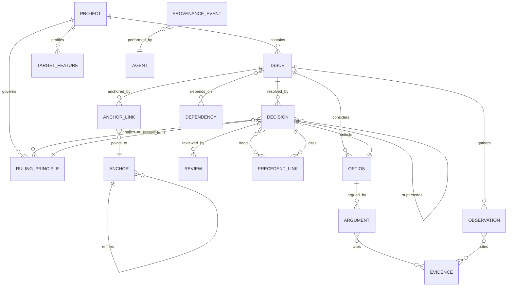
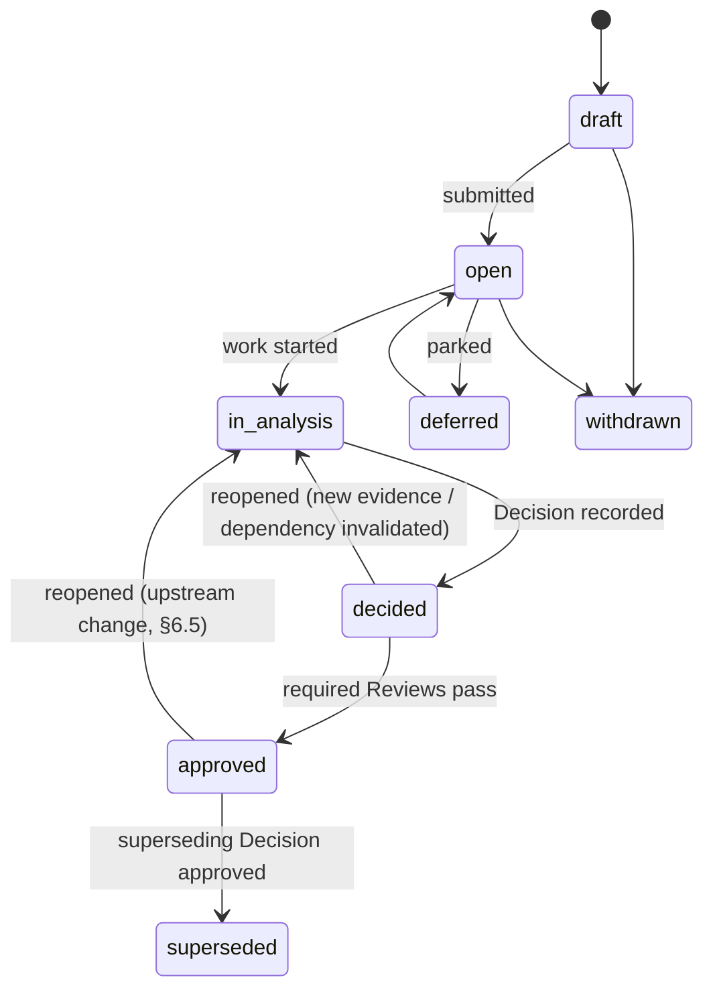
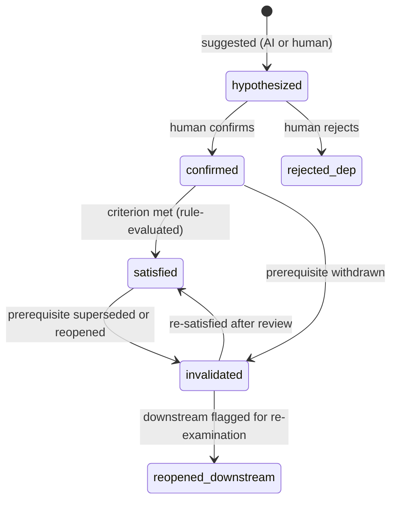

# 4. Proposed Domain Model

> Entities, attributes, relationships, lifecycle states, and provenance requirements. Terms are defined in [§2](02-terminology-and-conceptual-model.md). Physical schemas (tables, JSON, APIs) are in [§9 Technical Architecture](09-technical-architecture.md); this section is the conceptual model they implement.

## 4.1 Design principles

1. **Small mandatory core, progressive elaboration.** Creating an Issue requires only: title, one anchor, project. Everything else — options, arguments, dependencies, classifications — can be added later, by anyone, including AI (as suggestions). A model that demands a full form per decision will not be used (design-rationale "capture problem", §3.3).
2. **Relationships over properties.** Anything that could connect two records is an edge, not a string field: semantic domains, key terms, principles, precedents, dependencies. Properties are reserved for things intrinsic to one node (title, free text, confidence, timestamps).
3. **Derived values are never stored as if entered.** Downstream-impact counts, dependency satisfaction, recurrence — computed by rules, cached with a `rule-derived` origin, recomputable from scratch.
4. **Append-only history.** No destructive updates to decided/approved content. Supersession, not deletion.
5. **Origin class on everything.** `human-authored | human-approved | ai-suggested | rule-derived | imported-external` — no exceptions, including edges.

## 4.2 Entity–relationship overview

Every entity also implicitly connects to `PROVENANCE_EVENT` (omitted above for legibility): each create/update/state-transition emits one.

## 4.3 Entities

### 4.3.1 Project

The unit of ownership, access control, and principle scope.

| Attribute | Type | Notes |
|---|---|---|
| id, name | | |
| language | ISO 639-3 code + Glottolog languoid ID | Glottocode enables family-based cross-project queries |
| typology profile | set of feature values | Grambank-style feature IDs where applicable; free-form otherwise |
| translation brief | text + structured fields | audience, medium (written/oral/sign/multimedia), register, base philosophy |
| sharing policy | structured | what may be exported, at what anonymization level (§7 of brief; §13) |
| versification scheme | ID | needed to compare text anchors across projects |

### 4.3.2 Issue

| Attribute | Type | Required | Notes |
|---|---|---|---|
| id, project_id, title | | ✔ | |
| description | rich text | | |
| category | controlled vocab | | seeded from the brief's list (lexical, key-term, participant-reference, idiom, information-structure, honorifics, orthography, …); extensible per project; multi-valued |
| status | state machine | ✔ (defaults `draft`) | §4.5 |
| priority inputs | risk (enum), effort estimate (enum), deadline | | *only* human-entered priority inputs; leverage is computed (§6) |
| assignee, watchers | agent refs | | |
| recurrence class | rule-derived | | `recurring / exceptional / isolated / edge-case` — computed from anchor-sharing counts, human-overridable with override recorded |

### 4.3.3 Anchor and AnchorLink

Anchors are shared, deduplicated reference points; AnchorLinks bind a record to an anchor with role and confidence.

| Anchor attribute | Notes |
|---|---|
| type | `text / lemma / sense / domain / construction / discourse / key-term / target-feature / cultural-concept` |
| scheme | which reference system: versification ID for text; lexicon ID-space for lemma/sense (e.g. MACULA lemma IDs, Louw–Nida domain codes, SDBH domains); project vocabulary for the rest |
| value | the identifier in that scheme |
| label | display form |
| refines | optional parent anchor (sense refines lemma; subdomain refines domain; verse-span refines pericope) |

| AnchorLink attribute | Notes |
|---|---|
| record → anchor | |
| role | `subject` (what the issue is about) vs `context` (relevant setting) — a decision *about* ἀμνός in John 1:29 has lemma-subject + text-subject anchors; its Passover intertext is a context anchor |
| origin class | AI may *suggest* anchor links; they bind for retrieval only when human-approved or rule-derived from an approved link |

**Why anchors are the load-bearing entity:** precedent retrieval (§5) is fundamentally *anchor intersection with specificity weighting*. Getting anchor identity right (shared ID-spaces, refinement hierarchy) matters more than any other modeling choice. This is also the interoperability surface: external resources (MACULA, Louw–Nida, Paratext Biblical Terms, Grambank) enter the system as anchor schemes (§9.8).

### 4.3.4 Option

| Attribute | Notes |
|---|---|
| issue_id, rendering/strategy text | the candidate itself; may be a text rendering, a strategy description, or a principle formulation |
| gloss / back-translation | required for cross-team legibility when the rendering is in the target language |
| origin class | AI-suggested options are visually segregated until adopted |
| status | `proposed / shortlisted / selected / rejected / withdrawn` |

### 4.3.5 Observation & Evidence

Observation: `text`, `epistemic status` (`fact / judgment / hypothesis`), anchors, origin class.
Evidence: `source type` (lexicon, grammar, article, parallel passage, community-test report, corpus query, AI retrieval), `citation` (structured: resource ID + locator), `quote/extract`, `retrieval metadata` when AI-produced (model, prompt hash, timestamp — §9.6). An Evidence node whose source cannot be resolved to a known resource registry entry is flagged `unresolved-citation` and can never support an approved Decision silently (anti-hallucination rule, §8).

### 4.3.6 Argument

Optional layer. `stance` (`supports / opposes`), target Option, cited Evidence, free text. A Toulmin elaboration (`warrant`, `qualifier`, `rebuttal`) is available as optional structured fields, not required. Rationale-as-prose lives on the Decision; Arguments exist for teams that want inspectable structure.

### 4.3.7 Decision

| Attribute | Notes |
|---|---|
| issue_id, selected option | |
| rationale summary | prose; the minimum viable rationale |
| confidence | controlled scale (e.g., `tentative / working / firm`) — deliberately coarse; false numeric precision invites misuse |
| principles applied / excepted | edges to Ruling Principles; an `excepts` edge requires a stated distinguishing reason |
| decided_by, decided_at | |
| version, supersedes | append-only chain |
| approval state | derived from Reviews per project policy (e.g., "consultant + community reviewer required for key terms") |

### 4.3.8 Review

`decision_id`, `reviewer`, `role` (translator-peer / consultant / exegetical advisor / community reviewer / project admin), `verdict` (`approve / request-changes / dissent`), `comments`, `checklist results` (project-configurable). **Dissent is a persistent verdict, not a blocker**: a Decision can be approved over recorded dissent, and the dissent remains attached and retrievable — this preserves honest history and matters for later re-examination.

### 4.3.9 Dependency

Directed edge `from` (the dependent item) `on` (the prerequisite), with:

| Attribute | Values |
|---|---|
| type | `requires-decision` (evidentiary: the answer is needed), `requires-completion` (procedural: the activity must finish, e.g., "discourse analysis of Jonah 1"), `constrains` (the prerequisite's outcome limits admissible options), `informs` (soft) |
| hardness | `hard` (dependent cannot reach `approved` while unsatisfied) / `soft` (warning only) |
| blocking | whether it blocks work-start or only approval |
| scope | `instance` (this issue only) / `project-wide` (auto-instantiated for all issues matching an anchor pattern — e.g., every issue anchored to key-term "Lamb" depends on the key-term decision) |
| state | `hypothesized / confirmed / satisfied / invalidated / reopened` — §4.5; transitions are rule-driven (§6.2) |
| satisfaction criterion | machine-checkable where possible: "Issue X reaches `approved`"; else a human-attested completion |
| origin class | AI-suggested dependencies stay `hypothesized` until a human confirms |

### 4.3.10 Precedent link

`citing decision` → `cited decision record`, with `treatment` (`followed / adapted / distinguished / rejected`), `treatment rationale` (required for `distinguished`/`rejected` — the distinguishing characteristics, ideally as anchor references: "differs on target-feature:honorific-register"), `relevance profile snapshot` (the facets that made it a candidate, frozen at citation time — so later anchor edits don't rewrite history), origin class (retrieval is AI/rule; *treatment* is always human).

### 4.3.11 Ruling Principle

`statement`, `scope` (anchor pattern: e.g., all issues with domain-anchor LN 4.22–4.26), `status` (`proposed / adopted / superseded`), `distilled from` (the Decisions that motivated it), `exceptions` (incoming `excepts` edges). Principles are the generalization mechanism: when three Decisions follow the same reasoning, a Principle can be distilled (AI may draft it; humans adopt it), and future relevant Issues surface the Principle before individual precedents.

### 4.3.12 Agent & ProvenanceEvent

Agent: `human` (user account, roles per project) or `software` (rule engine version, AI model+version). ProvenanceEvent: append-only `(entity, activity-type, agent, timestamp, payload-diff, cause)` following the PROV Entity–Activity–Agent pattern; the full requirements list from the brief's §11 maps onto these events plus the entities above (change-propagation reaction in §6.5; implementation in [§9.6](09-technical-architecture.md)).

## 4.4 Relationship taxonomy (consolidated)

The brief listed ~18 candidate relationships. They resolve into **five irreducible edge families** plus computed relations:

| Family | Edges | Brief's terms covered |
|---|---|---|
| **Structural** | issue–option, option–argument, argument–evidence, issue–decision, decision–review | — |
| **Dependency** | `requires-decision`, `requires-completion`, `constrains`, `informs` | depends on, is prerequisite for, (soft) supports |
| **Precedent treatment** | `followed / adapted / distinguished / rejected` | reuses, is analogous to, is distinguished from |
| **Normative** | `applies-principle`, `excepts-principle`, `supersedes` | overrides, supersedes, creates an exception to, refines, generalizes, specializes |
| **Anchor-mediated (computed)** | shared-lemma, shared-sense, shared-domain, shared-construction, shared-discourse-feature, shared-referent, shared-target-feature, shared-cultural-concept, shared-principle | shares a semantic domain with, applies to the same referent, related construction, shared target-language characteristic, shared cultural characteristic |
| **Argumentative** | `supports`, `contradicts` (between Observations/Decisions) | supports, contradicts |

The key claim: *the entire "shares-X-with" family should never be stored as explicit edges.* They are computed from anchor intersection on demand (or materialized as a cache). Storing them explicitly creates an O(n²) maintenance disaster and drifts from the anchors that justify them.

## 4.5 Lifecycle state machines

### Issue lifecycle

Notes: `approved` is per-project-policy (which reviewer roles are required can differ by issue category — key terms typically need consultant + community review; a low-risk phrasing choice may auto-approve on peer review). Reopening never deletes the prior Decision; it starts a new version chain entry.

### Dependency lifecycle

`satisfied` is **always rule-evaluated from explicit data** (prerequisite state + criterion), never re-inferred by AI — this is the brief's requirement that dependency state "be determined through explicit data and deterministic rules," adopted wholesale (§6.2).

### Decision version chain

`v1 (approved)` —superseded-by→ `v2 (approved)` … Each version immutable; the Issue's "current decision" is a pointer maintained by rule.

## 4.6 Provenance requirements (summary)

Every requirement in the brief's §11 list maps to model elements:

| Requirement | Where |
|---|---|
| who/when created or modified | ProvenanceEvent on every mutation |
| evidence consulted | Evidence nodes + `viewed-evidence` events (optional telemetry) |
| alternatives considered | Option nodes with status history |
| AI prompts/outputs, model+version | Evidence/suggestion payloads carry model ID, parameters, prompt hash; full prompts in the audit store (§9.6) |
| retrieval sources | Evidence `citation` + retrieval metadata |
| reviews, approval, disagreement | Review nodes incl. persistent dissent |
| corrections, supersession history | Decision version chains + events |
| dependency changes | Dependency state-transition events |
| precedents applied/rejected + distinguishing reasons | Precedent links with treatment + rationale |
| downstream effects of change | rule-derived: invalidation cascade events (§6.5) |

## 4.7 What is deliberately absent

- **No global "correctness" field.** Approval is project-scoped; nothing marks a rendering as universally right (§13 risk R-T2).
- **No numeric importance score entered by hand.** Leverage is computed; humans enter risk/effort/deadline only.
- **No free-floating notes.** Everything attaches to an Issue or an anchor — otherwise the corpus degrades into the unsearchable notes field this system exists to replace. (Escape hatch: a lightweight "capture inbox" that AI helps triage into Issues/Observations, §7.3.)
- **No cross-project write access.** External records arrive only via explicit import with snapshotting (§5.7, §9).
