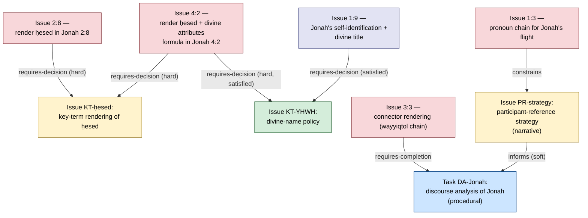

# 6. Dependency and Prioritization Framework

> Dependency modeling, fulfillment rules, change propagation, and high-leverage work identification. Entity definitions in [§4.3.9](04-domain-model.md); algorithm citations verified 2026-07-29 (details in [§3](03-research-and-prior-art-landscape.md)).

## 6.1 Dependency semantics

A Dependency is a directed edge `dependent → prerequisite` carrying type, hardness, blocking behavior, scope, state, and a satisfaction criterion (§4.3.9). The brief's seven requested distinctions map as follows:

| Brief's distinction | Where it lives |
|---|---|
| Hard vs. soft | `hardness` attribute: hard blocks the dependent's `approved` transition; soft only warns |
| Evidentiary vs. procedural | `type`: `requires-decision` (the *answer* is needed) vs. `requires-completion` (an *activity* must finish, e.g., "participant-reference analysis of Jonah complete") |
| Direct vs. transitive | only direct edges are stored; transitivity is computed (never stored — a stored transitive edge would go stale) |
| Project-wide vs. passage-specific | `scope`: `instance` vs. `project-wide` (an anchor-pattern rule that auto-instantiates edges — e.g., *every* Issue anchored to key-term "lamb" depends on the key-term Issue) |
| Human vs. automated fulfillment criteria | `satisfaction criterion`: machine-checkable (`Issue #123 reaches approved`) or human-attested (`analysis attested complete by role:advisor`) |
| Blocking vs. non-blocking | `blocking` attribute: blocks work-start vs. blocks only approval — a team may draft against an unresolved key term but not finalize |
| Confirmed vs. hypothesized | `state`: AI- or heuristic-suggested edges enter as `hypothesized` and never affect blocking until a human confirms |

Worked examples of the brief's five scenarios:

1. *Key term before passages*: project-wide `requires-decision` (hard, approval-blocking) from every issue anchored to the term.
2. *Participant-reference strategy before pronouns*: `constrains` edge from each pronoun-rendering Issue to the strategy Issue — the strategy's outcome limits admissible Options.
3. *Discourse analysis before connectors*: `requires-completion` (procedural) on the analysis task, human-attested.
4. *Cultural investigation before idiom approval*: `requires-completion`, evidentiary payload = the community-testing report Evidence node.
5. *Orthography before spelling standardization*: project-wide procedural dependency, blocking a whole *category* of issues (scope by category anchor).

## 6.2 Fulfillment: deterministic rules only

Dependency state is **computed by rules over explicit data — never re-inferred by AI** (adopting the brief's requirement). The full rule set is small:

```
satisfied(dep)   ⇐ dep.state = confirmed
                   ∧ criterion_met(dep)
criterion_met    ⇐ (dep.criterion = state-reach ∧ prerequisite.status ≥ dep.required_state)
                 ∨ (dep.criterion = attestation ∧ ∃ attestation by required role)
invalidated(dep) ⇐ dep was satisfied
                   ∧ (prerequisite superseded ∨ prerequisite reopened ∨ attestation revoked)
blocked(issue)   ⇐ ∃ dep from issue: dep.hardness = hard ∧ dep.blocking-mode covers the
                   attempted transition ∧ dep.state ∉ {satisfied}
ready(issue)     ⇐ issue.status ∈ {open, in-analysis} ∧ ¬∃ unsatisfied hard work-blocking dep
```

"Partially fulfilled" is not a dependency state — it is an *issue-level* derived quantity (`3 of 5 hard dependencies satisfied`), displayed but never used in blocking logic. This keeps the state machine crisp while giving users the progress signal the brief asked for.

**AI's only roles** here: *suggesting* `hypothesized` edges (e.g., noticing a draft rationale mentions an unresolved question) and *drafting* satisfaction criteria — both human-confirmed before they have any effect (§8).

## 6.3 Cycles

Human-entered dependencies will create cycles ("the honorific strategy depends on how we render God's speech to Jonah; that rendering depends on the honorific strategy"). Policy:

- **At edge creation**: a reachability check (cheap at this scale) warns immediately: "this creates a mutual dependency with …".
- **If accepted**: the cycle is *kept*, not rejected. Strongly-connected components are computed (Tarjan 1972) and each SCC is presented as a **decision cluster**: "these 4 issues are mutually entangled — resolve jointly." This is more honest than forbidding cycles; mutual constraint is a real phenomenon in translation (and the joint-resolution session is a recognizable team practice). The condensation of the graph (SCCs collapsed) is a DAG, on which all ordering/leverage computations run.

## 6.4 Prioritization: identifying high-leverage work

Adopted model — three explainable layers, no opaque composite:

1. **Feasibility frontier (deterministic).** Kahn-style zero-unsatisfied-dependency frontier = "workable now" list (Kahn 1962). Topological order is presented as a *constraint*, never as "the" order.
2. **Leverage (deterministic).** For each unresolved issue X: **transitive reach** = |descendants(X)| in the condensed dependency graph — and, sharper, the **sole-blocker count**: descendants whose only unsatisfied ancestor path runs through X ("approving X immediately unblocks 7 issues covering 34 verses"). Chosen over alternatives after honest assessment: betweenness centrality is meaningless on dependency graphs (dependencies aren't flow paths) and PageRank's damping semantics are unmotivated here; descendant counting is exact, O(V+E), and explainable to a translation team in one sentence. Caveat surfaced in UI: reach numbers of different candidates overlap — they must not be summed.
3. **Value/effort ranking (heuristic, visible components).** A WSJF-style score (Reinertsen 2009): `(reach-weighted value + deadline criticality + risk reduction) / effort estimate`, with all inputs coarse (T-shirt sizes — false precision in effort estimates would dominate the ratio) and **every component displayed**. Deadline criticality typically means an upcoming consultant visit or checking session — a real and motivating constraint in field practice. Critical-path analysis (Kelley & Walker 1959) is offered as an optional lens when issues carry duration estimates, with the documented caveat that it assumes unconstrained resources, which a 3-person team is not.

Explicitly **not** built (assessed and rejected for v1, revisitable later):
- **Constraint propagation (AC-3, Mackworth 1977)**: pays off only when Options are enumerated with cross-issue compatibility constraints. The one propagation behavior worth having — "decision A resolved; flag downstream Options now inconsistent" — is a single rule, not a constraint engine. The data model leaves room for option-level constraints so this can be added without migration.
- **Information-gain / active-learning prioritization**: the analogy is attractive but unsound here — there is no predictive model whose uncertainty a resolution reduces; the framing collapses back to reach-weighting. The system must not claim to "do active learning." (A legitimate future use: choosing which retrieval results to have experts judge when tuning the relevance model, §5.8.)

**Override:** priorities are recommendations. A project lead can pin, demote, or re-order; every override is recorded (input to tuning and to the efficacy study's trust measures). The prioritization view always answers "why is this ranked here?" with its components — reach, deadline, risk, effort — each traceable to data.

## 6.5 Change propagation: when a foundational decision changes

The dreaded case: a key-term Decision is revised after 40 issues were resolved in its shadow. Reaction is **staged, deterministic, and human-gated**:

1. **Supersession event.** The new Decision version is approved; the old one is marked superseded (never deleted).
2. **Invalidation cascade (rule-driven).** Every dependency whose prerequisite was the superseded Decision transitions `satisfied → invalidated`. Every downstream Decision holding a `followed`/`adapted` Precedent link to it gets flagged `precedent-superseded`.
3. **Re-examination queue, not auto-reversal.** Affected issues do **not** reopen automatically (mass auto-reopening would be destructive and wrong — many downstream decisions survive an upstream change). They enter a triage queue, grouped and ranked by reach, with the *reason* attached ("your rendering followed v1 of the ḥesed decision; v2 changed the default rendering in narrative"). Humans disposition each: `unaffected` (one click, recorded) or `reopen`.
4. **Batch assistance.** AI may pre-sort the queue by drafting an assessment per item ("rendering here does not use the changed term form — likely unaffected") — labeled suggestions only (§8).
5. **Propagation stops at project boundaries.** Cross-project: subscribers to a shared record receive a notification; nothing changes in their project without local action (§5.7).

This staged design is the direct answer to the brief's §11 question ("how should the system react when a foundational decision changes"): *detect deterministically, propose comprehensively, change nothing without a human*.

## 6.6 Example dependency graph

A fragment from the Jonah pilot corpus (worked example in [§15](15-worked-example.md); illustrative):



Leverage reading: resolving `KT-ḥesed` is the sole remaining blocker for issues 2:8 and 4:2 (reach = 2 here; in a full-book corpus, a ḥesed-class key term reaches dozens of issues across the canon) — so it ranks at the top of the "high-leverage" list, with that explanation attached.

## 6.7 Computation notes

Project decision graphs are small (10²–10⁴ nodes). **Recompute from scratch on every mutation** — topological frontier, SCCs, reach counts are all O(V+E), i.e., milliseconds; incremental machinery is premature optimization. The one incremental computation worth having is the notification set on resolution: `newly-unblocked(X) = {dependents of X with no other unsatisfied hard dependency}` — cheap, and it is exactly the event users want pushed ("approving KT-ḥesed unblocked 2 issues assigned to you"). Implementation options (recursive CTEs vs. in-process graph library) in [§9.5](09-technical-architecture.md).
