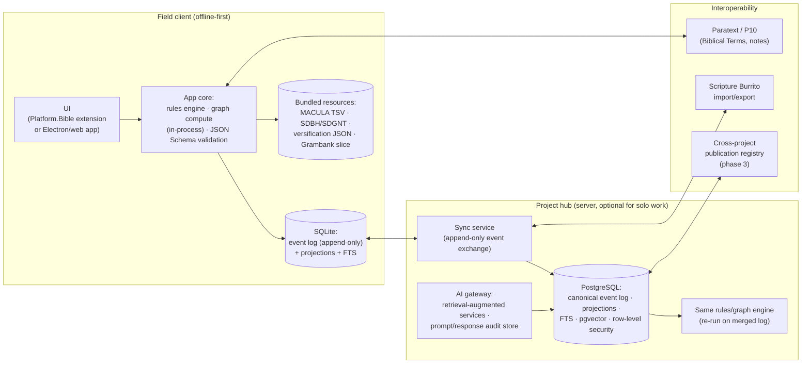

# 9. Technical Architecture

> Recommended architecture, alternatives, data model, examples, and APIs — enough specificity to guide prototyping, deliberately short of a production codebase. Research grounding (licenses, tool status) in [§3.8](03-research-and-prior-art-landscape.md); all tool-status claims verified 2026-07-29.

## 9.1 Recommended architecture: local-first SQLite + event log, Postgres hub, graph-in-code



**Core commitments:**

1. **Event-sourced system of record.** Every mutation is an append-only, signed event (`IssueCreated`, `OptionAdded`, `DecisionRecorded`, `ReviewSubmitted`, `DependencyConfirmed`, `SuggestionPromoted`, …). Current state = deterministic projection. This buys: the audit/provenance requirements of [§4.6](04-domain-model.md) for free; temporal queries ("what did we believe in March?"); and — decisively for field use — **append-only logs merge trivially under intermittent connectivity** (conflicts are rare and commutative; the few real conflicts, e.g., two concurrent Decisions on one Issue, become explicit merge Issues rather than silent overwrites). Scope discipline: event-source the decision log only, not the whole app (a documented over-application failure mode).
2. **SQLite on the client, PostgreSQL on the hub.** Same logical schema; the client is fully functional offline for weeks (Paratext's Send/Receive and Translator's Workplace's flash-drive channel are the field precedents). Sync = exchanging event-log segments; a purpose-built append-only exchange is small enough to own, with PowerSync (service under FSL; SDKs Apache/MIT) as the buy-option behind an abstraction — the ElectricSQL pivot shows this tool category churns, so the abstraction matters more than the vendor.
3. **Graph compute in code, not a graph database.** Decision graphs are 10²–10⁴ nodes; every needed computation (frontier, SCC condensation, reach, invalidation cascade) is O(V+E) in-process — milliseconds, recomputed from scratch on mutation ([§6.7](06-dependency-and-prioritization.md)). The embedded-graph-DB option died with Kùzu (archived Oct 2025 post-acquisition); Neo4j/Memgraph are server-heavy for field clients. If hub-side graph *querying* becomes valuable, Apache AGE (openCypher on Postgres, Apache 2.0) adds it without a second database; queries written to openCypher for GQL-era portability.
4. **Search: FTS first, vectors additive.** SQLite FTS5 / Postgres FTS over titles, rationales, observations; pgvector on the hub for the lowest-tier relevance facet (D17) — per-project indexes only (isolation, [§8.3](08-ai-and-deterministic-boundaries.md)). No vector DB product; not at this scale.
5. **Records are JSON documents validated by JSON Schema (2020-12) at write time**, with a JSON-LD `@context` mapping fields to PROV-O/SKOS terms — standards alignment without running an RDF stack. Controlled vocabularies maintained as SKOS files (multilingual labels).
6. **AI strictly server/gateway-side** (or explicitly configured local models), never required for core workflows; the client degrades gracefully to deterministic-only operation offline.
7. **Delivery**: primary target is a **Platform.Bible extension** (MIT, active; direct access to Paratext-world projects) with the app core kept platform-agnostic (TypeScript library) so a standalone Electron/web build serves Scribe/SB-world users. Export/preservation: full event log + projections as a **Scripture Burrito extension** (`x-` flavor), plus plain JSON-lines dumps — long-term preservation must not depend on this software surviving.

## 9.2 Alternatives considered

| | **A (recommended): SQLite/Postgres event-sourced + graph-in-code** | **B: RDF/triple-store stack** (Fuseki/Oxigraph, PROV-O + SKOS native, SHACL, SPARQL) | **C: Property-graph-centric** (Neo4j/Memgraph as primary store) |
|---|---|---|---|
| Standards alignment | good (JSON-LD/SKOS/PROV vocabularies) | **best** — native | weak (proprietary-ish models; GQL emerging) |
| Offline field clients | **best** (SQLite ubiquitous) | poor (embedded triple-stores niche) | poor (server processes, JVM/RAM) |
| Graph queries | in-code + optional AGE | SPARQL good | **best** (Cypher ergonomics) |
| Provenance/audit | **best** (event log native) | good (named graphs; more assembly) | moderate (bolt-on) |
| Validation | JSON Schema + invariant checks | SHACL — most expressive for graph invariants | app-level |
| Developer availability | **best** | scarce | moderate |
| Licensing | all permissive | permissive options exist | Neo4j Community GPLv3 single-instance; Memgraph BSL |
| Verdict | **build** | keep as *export projection* (publish an RDF/PROV view for research interop) — not the operational store | adopt only if graph UX outgrows AGE |

Tradeoff summary: A optimizes for the two binding constraints — field operation and auditability — and accepts hand-rolled graph code (cheap at this scale). B optimizes semantic interop the field doesn't need operationally (recovered via export). C optimizes query ergonomics the scale doesn't demand, at the worst deployment cost.

## 9.3 Physical data model (representative)

Relational projections (SQLite/Postgres — same DDL modulo dialect):

```
events(seq, event_id, project_id, entity_type, entity_id, event_type,
       actor_id, actor_kind, occurred_at, payload_json, prev_hash, hash)   -- append-only
issues(id, project_id, title, description, status, category[], risk,
       effort, deadline, assignee_id, created_at, ...)                      -- projection
options(id, issue_id, rendering, gloss, origin_class, status, ...)
decisions(id, issue_id, option_id, version, supersedes_id, rationale,
          rationale_types[], confidence, decided_by, decided_at, approval_state)
reviews(id, decision_id, reviewer_id, role, verdict, comments, checklist_json, at)
anchors(id, type, scheme, value, label, refines_id)                         -- deduplicated
anchor_links(record_type, record_id, anchor_id, role, origin_class, confidence)
dependencies(id, from_type, from_id, on_type, on_id, dep_type, hardness,
             blocking_mode, scope, state, criterion_json, origin_class)
precedent_links(id, citing_decision_id, cited_record_id, cited_project_id,
                treatment, treatment_rationale, relevance_snapshot_json, created_by, at)
principles(id, project_id, statement, scope_pattern_json, status, ...)
observations / evidence / suggestions / ai_audit(...)                       -- per §4
resource_registry(id, name, kind, version, license, locator_scheme)
```

Graph view (node/edge types) is exactly the [§4.2](04-domain-model.md) ER model; in-code the dependency graph loads as adjacency lists from `dependencies`.

## 9.4 Example JSON objects

**Decision** (projection; abridged — full provenance in the event log):

```json
{
  "id": "dec_01J9XKQ",
  "issue": "iss_01J9WPB",
  "version": 2,
  "supersedes": "dec_01J8ZRT",
  "selectedOption": "opt_01J9WQC",
  "rationale": "Retain 'lamb' with a footnote rather than substitute the local sacrificial animal; Passover intertext (Ex 12) and Isa 53:7 allusion outweigh naturalness cost. Community testing showed the borrowed term is learnable.",
  "rationaleTypes": ["intertext-preservation", "contextual-assumption-gap"],
  "confidence": "firm",
  "principlesApplied": ["prin_keyterm_borrowing"],
  "principlesExcepted": [],
  "decidedBy": "user_mchavez",
  "decidedAt": "2026-05-12T09:41:00Z",
  "approvalState": "approved",
  "anchors": [
    {"type": "text", "scheme": "org", "value": "JHN 1:29", "role": "subject"},
    {"type": "lemma", "scheme": "macula-greek", "value": "ἀμνός", "role": "subject"},
    {"type": "sense", "scheme": "sdgnt", "value": "amnos:001", "role": "subject"},
    {"type": "key-term", "scheme": "project-terms", "value": "kt_lamb", "role": "subject"},
    {"type": "cultural-concept", "scheme": "project-culture", "value": "cc_animal_sacrifice", "role": "context"}
  ],
  "originClass": "human-authored"
}
```

**Dependency**:

```json
{
  "id": "dep_01J9XM2",
  "from": {"type": "issue", "id": "iss_rev5_arnion"},
  "on": {"type": "issue", "id": "iss_jhn129_amnos"},
  "depType": "requires-decision",
  "hardness": "hard",
  "blockingMode": "approval-only",
  "scope": "instance",
  "state": "confirmed",
  "criterion": {"kind": "state-reach", "requiredState": "approved"},
  "originClass": "ai-suggested",
  "confirmedBy": "user_tlead",
  "history": [
    {"state": "hypothesized", "at": "2026-05-02T10:11:00Z", "actor": "model:claude-x@2026-04"},
    {"state": "confirmed", "at": "2026-05-02T14:02:00Z", "actor": "user_tlead"}
  ]
}
```

**Precedent link**:

```json
{
  "id": "prec_01JA2B7",
  "citingDecision": "dec_rev5_arnion_v1",
  "citedRecord": {"project": "self", "decision": "dec_01J9XKQ"},
  "treatment": "adapted",
  "treatmentRationale": "Same referent and sacrificial frame; Revelation's ἀρνίον is diminutive in form but not sense — followed the borrowing strategy, adjusted the modifier for the exalted-Lamb context.",
  "relevanceSnapshot": {
    "matched": [
      {"dim": "key-term", "value": "kt_lamb"},
      {"dim": "referent", "value": "ref_jesus"},
      {"dim": "domain", "scheme": "sdgnt-domains", "value": "sacrificial-animals"}
    ],
    "differing": [
      {"dim": "lemma", "note": "ἀμνός vs ἀρνίον"},
      {"dim": "genre", "note": "gospel narrative vs apocalyptic"}
    ]
  },
  "createdBy": "user_mchavez",
  "originClass": "human-approved"
}
```

**Review**:

```json
{
  "id": "rev_01JA3CD",
  "decision": "dec_01J9XKQ",
  "reviewer": "user_consultant_ak",
  "role": "consultant",
  "verdict": "approve",
  "comments": "Concur; footnote wording should cite Ex 12 explicitly. Note dissent from community reviewer on naturalness — retained and visible.",
  "checklist": {"exegesis": "pass", "keyTermConsistency": "pass", "communityTesting": "attested"},
  "at": "2026-05-20T16:00:00Z"
}
```

## 9.5 Representative rules and pseudocode

**Dependency fulfillment (rule-driven, event-triggered):**

```
on event E affecting entity P:                     # e.g. DecisionApproved(P)
  for dep in dependencies where dep.on == P and dep.state == "confirmed":
      if criterion_met(dep, P): emit DependencySatisfied(dep)
  if E in {DecisionSuperseded, IssueReopened, AttestationRevoked}:
      for dep in dependencies where dep.on == P and dep.state == "satisfied":
          emit DependencyInvalidated(dep)
          for d2 in dependents_of(dep.from): flag_for_reexamination(d2, cause=dep)
  recompute_projections()                          # frontier, reach, SCC — full recompute, O(V+E)
  notify(newly_unblocked = {c in children(P) : all_hard_deps_satisfied(c)})
```

**Precedent retrieval (three tiers, per [§5.4](05-relevance-and-precedent-framework.md)):**

```
def candidates(issue):
    scope   = eligible_projects(issue.project)                 # Tier 0: policy/consent/trust filters
    ruled   = principles_in_scope(issue.anchors)               # Tier 1: deterministic
            ∪ co_dependents(issue) ∪ explicit_links(issue)
    pool    = records_sharing_any_anchor(issue.anchors, scope) # anchor-intersection candidates
            ∪ fts_and_vector_neighbors(issue.text, scope)      # recall net (D17)
    scored  = [(r, profile(issue, r)) for r in pool − ruled − suppressed(issue)]
    ranked  = top_k(scored, key = Σ w[issue.category][dim] * match * specificity)
    return ruled_panel(ruled), ranked_panel(ranked with facet_explanations)
```

Weights `w` live in versioned config, per category; every ranked item carries its facet breakdown (no bare scores in UI).

## 9.6 Provenance and audit implementation

- The **event log is the provenance record**: hash-chained (`prev_hash`), actor-attributed, append-only; PROV-O export is a projection (`event → prov:Activity`, `entity version → prov:Entity`, `actor → prov:Agent`, supersession → `prov:wasRevisionOf`).
- **AI audit store**: full prompts/responses/parameters keyed from suggestion events (payloads stay out of the main log to keep it lean), plus the per-call **context manifest** — included items with selection reasons and excluded candidates with exclusion reasons ([§8.2](08-ai-and-deterministic-boundaries.md)); retention policy per project.
- **Immutability**: approved-content tables accept no UPDATE from the app role (DB constraint); revision = new version row + supersession event ([§8.3](08-ai-and-deterministic-boundaries.md) "hidden changes" safeguard).
- Access control: role-per-project RBAC; hub enforces Postgres row-level security by project; publication registry is the *only* cross-project read path.

## 9.7 Representative API (hub; client mirrors locally)

```
POST   /projects/{p}/issues                       create issue (title + anchors minimum)
GET    /projects/{p}/issues?status=&category=&ready=&sort=leverage
POST   /projects/{p}/issues/{i}/options|observations|decisions
GET    /projects/{p}/issues/{i}/candidates        precedent panels (ruled + ranked + explanations)
POST   /projects/{p}/decisions/{d}/reviews
POST   /projects/{p}/decisions/{d}/supersede      begins revision workflow; returns impact preview
POST   /projects/{p}/dependencies                 create (state=hypothesized|confirmed)
POST   /projects/{p}/dependencies/{id}/confirm|reject|attest
GET    /projects/{p}/graph/frontier|reach|clusters
GET    /projects/{p}/verses/{ref}/records         scripture-first payload (versification-normalized)
POST   /projects/{p}/suggestions/{s}/promote|reject
GET    /projects/{p}/audit?entity=&actor=&model=
POST   /projects/{p}/publications                 publish records per sharing policy
POST   /projects/{p}/imports                      snapshot-import external record
GET    /projects/{p}/export?format=burrito|jsonl|prov
POST   /sync/events                               append-only event exchange (client↔hub)
```

## 9.8 Mapping external resources in

| Resource | Enters as | Mechanism |
|---|---|---|
| Scripture text (project draft) | text substrate | USFM/USJ parse; tokens aligned to MACULA IDs where source-aligned; quote+occurrence anchoring for edit resilience (tN pattern) |
| MACULA Greek/Hebrew | lemma/sense/referent/construction anchor schemes + evidence payloads | bundled TSV, keyed by token ID |
| SDBH / SDGNT | sense + domain anchor schemes; lexicon Evidence | XML/JSON import → SKOS scheme (CC BY-SA obligations tracked in resource registry) |
| Versification | text-anchor normalization | Copenhagen JSON mappings to "org" base |
| Paratext Biblical Terms | key-term anchor scheme; renderings import/export | BiblicalTerms XML + project renderings round-trip |
| unfoldingWord tN/tW | seed Evidence corpus; anchoring pattern | TSV import, rc:// links preserved as citations |
| Glottolog / Grambank | project language identity + typology profile (D13/D14 facets) | CLDF slices bundled |
| FLEx lexicon | target-feature anchors; target-language Evidence | LIFT import, entry-ID links |
| Alignment data | "how was this token rendered" Evidence | Clear-Bible alignments format / SB alignment flavor |
| BDAG/HALOT etc. (licensed) | citation pointers only | resource-registry entries with locator schemes; no content stored |

Every import records resource version in the registry; anchors carry their scheme+version so cross-project comparison can detect scheme mismatches ([§5.7](05-relevance-and-precedent-framework.md) version compatibility). For interchange, anchors are exportable as W3C Web Annotation selectors (text quote + position selectors alongside the token-ID form), keeping the anchoring model legible to standard annotation tooling ([§3.8](03-research-and-prior-art-landscape.md)).
