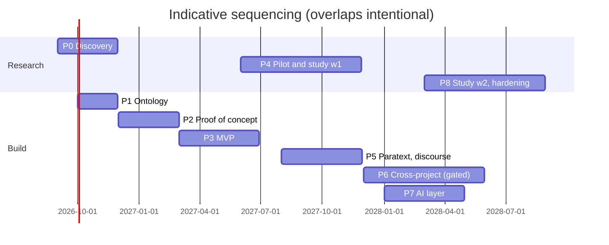

# 11. Phased Roadmap

> Each phase: goals, outputs, dependencies, risks, exit criteria. Durations are rough planning figures for a small team (2–3 builders + part-time domain advisors), not commitments. Phases overlap deliberately; exit criteria gate the *next* phase's main bet, not all activity.

## Phase 0 — Discovery and field research (2–3 months)

- **Goals:** validate the capture-cost and precedent-usefulness assumptions with practitioners *before* building; recruit 1–2 pilot partners; observe real consultant-checking sessions; test terminology ([§2](02-terminology-and-conceptual-model.md)) with the people who must adopt it.
- **Outputs:** interview corpus (≥10 translators/consultants across written + oral projects); a hand-collected corpus of ~50 real translation decisions with their actual dependencies and reuse events (paper prototype of the data model); partner MOUs incl. data-use terms; revised terminology.
- **Dependencies:** partner org introductions (SIL/UBS/seed-company networks; ETEN Innovation Lab is a natural venue).
- **Risks:** access to field teams; enthusiasm bias from early adopters.
- **Exit:** the paper decision corpus demonstrates ≥1 genuine multi-decision dependency chain and ≥5 genuine precedent-reuse events — i.e., the thesis phenomena exist in the wild and the model can express them. If not, revise the thesis before building.

## Phase 1 — Ontology and data-model design (6–8 weeks, overlapping Phase 0)

- **Goals:** freeze v1 of the schema, anchor schemes, vocabularies, event catalog; resolve licensing plumbing.
- **Outputs:** JSON Schemas + SKOS vocabularies (categories, treatments, rationale types, dependency types); anchor-scheme registry (MACULA/SDBH/versification versions pinned); event catalog; the Jonah reference dataset assembled ([§10.4](10-mvp-definition.md)).
- **Risks:** over-modeling (the capture problem in schema form) — mitigated by requiring every mandatory field to be justified by a Phase-0 observation.
- **Exit:** the 50-decision paper corpus round-trips into the schema losslessly; two external reviewers (a consultant + a linguist) sign off on vocabulary sanity.

## Phase 2 — Proof of concept (2–3 months)

- **Goals:** the deterministic core working end-to-end on the Jonah dataset — no UI polish, no AI.
- **Outputs:** app core library (events, projections, rules, graph, retrieval tiers 0–2 without embeddings); CLI/dev-UI harness; the [§10.9](10-mvp-definition.md) scenario running headless in tests.
- **Exit:** dependency state machine and invalidation cascade behave per spec under property-based tests; anchor-intersection retrieval returns the *designed* precedents for the seeded corpus (sanity precision, not a study).

## Phase 3 — Translator-facing MVP (3–4 months)

- **Goals:** the [§10](10-mvp-definition.md) scope complete, usable by a real team.
- **Outputs:** Electron/web app, seven screens, minimal AI assists behind the gateway with full audit; naive sync; onboarding materials.
- **Dependencies:** Phase 2 core; pilot partner committed.
- **Risks:** capture cost in practice exceeds tolerance; retrieval precision without embeddings disappoints (fallback: add the D17 text-similarity facet).
- **Exit:** a pilot team of 2–3 uses it for two consecutive weeks of *real* work with ≥60% of their translation questions entering the system (self-reported + log-verified), and SUS ≥ 68.

## Phase 4 — Pilot project + efficacy study wave 1 (4–6 months)

- **Goals:** run the [§12](12-efficacy-study.md) protocol's baseline + within-subject components on 1–2 live projects; iterate weekly.
- **Outputs:** study data (retrieval P@5/nDCG with consultant judgments, time-on-task, consistency deltas, trust trajectories); prioritized fix list; go/no-go evidence for the thesis.
- **Risks:** study contamination by iteration (accepted: this wave is formative; confirmatory measurement is wave 2); partner attrition.
- **Exit:** pre-registered success criteria from §12 evaluated honestly — the explicit possibility of a negative result is the point of this phase.

## Phase 5 — Paratext-world integration + discourse vocabulary (parallel track, 3–4 months)

- **Goals:** Platform.Bible extension packaging; Biblical Terms round-trip; the Levinsohn-seeded discourse SKOS scheme developed *with* SIL practitioners (this is a community artifact, not a solo authorship task).
- **Risks:** Platform.Bible pre-1.0 API churn; SIL engagement bandwidth.
- **Exit:** extension runs against a real Paratext project; discourse vocabulary v0.1 endorsed by ≥2 SIL-tradition consultants.

## Phase 6 — Cross-project precedent support (4–6 months; gated)

- **Goals:** publication/consent/import machinery of [§5.7](05-relevance-and-precedent-framework.md); typology-based (D9/D14) cross-language retrieval; trust registries.
- **Hard gate:** a written data-governance framework co-developed with partner orgs and communities (CARE-aligned; [§13](13-risks-and-open-questions.md)) *before* any real cross-project data moves. Do not build this phase's live features until the thesis is validated in-project — the brief's "what not to build until validated" answer, made explicit.
- **Exit:** two consenting projects exchange ≥10 precedents; local teams demonstrably distinguish/reject external ones; zero governance incidents.

## Phase 7 — Full AI-assistance layer (3–4 months, overlapping 6)

- **Goals:** the complete [§8](08-ai-and-deterministic-boundaries.md) suggestion suite (missing-dependency detection, consistency narration, comparison drafting, re-examination pre-sorting, retrieval-augmented research) with acceptance-rate monitoring.
- **Exit:** suggestion acceptance ≥ some floor with *stable-or-rising* trust scores (rising acceptance with falling trust = automation-bias alarm, triggers design review); AI-off mode remains fully functional.

## Phase 8 — Production hardening + efficacy wave 2 (ongoing)

- **Goals:** RBAC/RLS, robust sync, backup/preservation exports (Burrito + PROV), multilingual UI, oral/sign media support; confirmatory (non-formative) efficacy measurement per [§12](12-efficacy-study.md); sustainability plan (org partnership, funding, open-source governance).
- **Exit:** a partner org commits to deployment beyond the pilot; preservation export verified restorable by an independent party.

