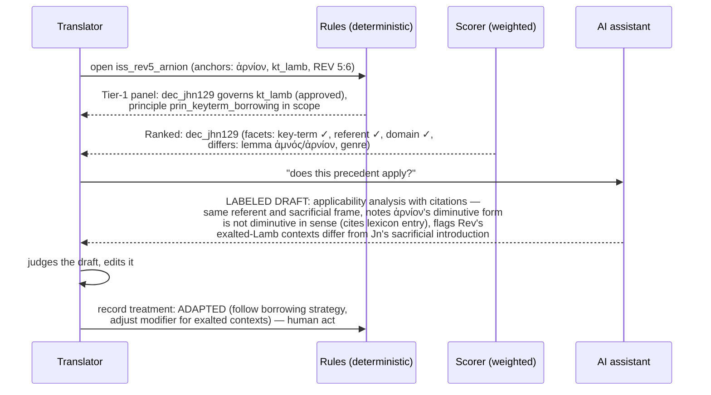

# 15. Worked Example: ἀμνὸς τοῦ θεοῦ (John 1:29)

> An end-to-end walkthrough of the system on one decision. **Framing disclaimer:** the passage, the fictional "Kalui" project, and every rendering choice below are *illustrative of the machinery only*. Nothing here implies that any particular rendering of "Lamb of God" is correct — that judgment belongs to each translation team and community. The scenario is chosen because it is a classic, well-documented *type* of problem (key term + cultural mismatch + intertextual freight), not because it has a right answer.

**Scenario:** the Kalui project (fictional; a lowland language, no sheep-herding tradition, pigs are the sacrificial animal; oral-preference community; translation brief: meaning-based, church-reviewed). The team reaches John 1:29: ὁ ἀμνὸς τοῦ θεοῦ ὁ αἴρων τὴν ἁμαρτίαν τοῦ κόσμου.

## 15.1 The translation question (Issue)

The translator selects "Lamb of God" in the Scripture view and raises an Issue (20-second capture; auto-anchored):

```json
{
  "id": "iss_jhn129_amnos",
  "title": "How to render ἀμνὸς τοῦ θεοῦ when Kalui has no sheep and pigs are the sacrificial animal?",
  "category": ["key-term", "cultural-concept", "figurative-language"],
  "status": "open",
  "risk": "high",
  "anchors": [
    {"type": "text",    "scheme": "org",          "value": "JHN 1:29",    "role": "subject",  "origin": "rule-derived"},
    {"type": "lemma",   "scheme": "macula-greek",  "value": "ἀμνός",      "role": "subject",  "origin": "rule-derived"},
    {"type": "sense",   "scheme": "sdgnt",         "value": "amnos:sacrificial", "role": "subject", "origin": "ai-suggested → human-approved"},
    {"type": "key-term","scheme": "project-terms", "value": "kt_lamb",    "role": "subject",  "origin": "rule-derived"},
    {"type": "cultural-concept", "scheme": "project-culture", "value": "cc_animal_sacrifice", "role": "context", "origin": "human-authored"},
    {"type": "target-feature",   "scheme": "project-lang",    "value": "tf_no_ovine_lexicon", "role": "context", "origin": "human-authored"}
  ]
}
```

On creation, the deterministic Tier-1 panel already shows: the project Principle **prin_keyterm_borrowing** ("unknown-referent key terms: prefer borrowing + taught footnote over cultural substitution; adopted after the 'camel' decisions in Mark") is *in scope* via the key-term category; and two **co-dependents** — the team's open Issues on sacrifice vocabulary anchored to `cc_animal_sacrifice`.

## 15.2 Observations, evidence, alternatives

Recorded over several sessions (each a small node, most in under a minute):

- **Obs-1** (exegetical advisor, *fact*): ἀμνός in Jn 1:29/1:36 evokes Passover lamb (Ex 12) and the Isa 53:7 servant; Rev uses ἀρνίον 28×. Evidence: SDGNT entry; commentary citation via resource registry.
- **Obs-2** (translator, *fact*): Kalui has no ovine vocabulary; regional trade language has "sipsip" (borrowed), known to younger speakers.
- **Obs-3** (community reviewer, *judgment*): substituting "pig of God" is felt to be irreverent by church elders despite pigs being the sacrificial animal — sacrifice frame and honor frame conflict. Evidence: community-testing report CT-014 (attached).
- **Obs-4** (AI, *labeled suggestion, promoted after review*): retrieval from registered resources — the classic "seal of God" cultural-substitution discussion in translation literature; surfaced as background reading with citations, not as an argument.

**Options:**

| Option | Origin | Status |
|---|---|---|
| O1: Borrow "sipsip" + first-use footnote ("a sacrificial animal like a young …") | human | shortlisted |
| O2: Cultural substitute (local sacrificial animal) | human | rejected (Obs-3) |
| O3: Generic + qualifier: "God's sacrifice-animal" | human | shortlisted |
| O4: Simile expansion: "the one who is like a sacrificial animal God provides" | ai-suggested | proposed |

Arguments attach evidence to options (e.g., *supports O1*: intertextual chain to Ex 12/Isa 53 preserved only if a consistent referent term exists across OT and NT — warrant: the project will translate Exodus later; *opposes O4*: turns a title into a description, breaking the vocative/title uses in Rev).

## 15.3 Dependencies

The team records (and one AI suggestion is confirmed):

1. `iss_jhn129_amnos` **requires-decision** (hard, approval-blocking) → `iss_kt_sacrifice_vocab` — the general sacrifice-vocabulary decision (which noun class Kalui uses for offering-animals) must be approved first; the rendering must fit that system. *(evidentiary, instance)*
2. `iss_jhn129_amnos` **requires-completion** (hard) → `task_ct_lamb` — a second community test of the borrowing option with older speakers. *(procedural; human-attested by community reviewer)*
3. **Project-wide** rule: every Issue anchored to `kt_lamb` depends on this Issue once decided — auto-instantiating for Jn 1:36, and later for Acts 8:32, 1 Pet 1:19, and the Rev ἀρνίον cluster (via the key-term anchor, which spans both lemmas by design).

Dependency 1 makes the leverage list: `iss_kt_sacrifice_vocab` is now sole blocker for three Issues — it jumps the priority queue with that explanation attached.

## 15.4 Decision and human review

After the sacrifice-vocabulary Decision is approved and CT-021 attested, the translator records the Decision: **O1 selected**, rationale as in [§9.4](09-technical-architecture.md)'s JSON example (borrow + footnote; intertext outweighs naturalness cost; community testing shows learnability), confidence `working`, Principle `prin_keyterm_borrowing` **applied** (no exception needed).

Review routing (key-term + high risk): consultant + community reviewer required.
- Community reviewer: **approve**.
- Consultant: **approve**, with comment; one team member records **dissent-but-approve** (prefers O3 for oral naturalness) — the dissent persists on the record, visible to anyone who later retrieves this as a precedent.

Status: `approved`. The project-wide dependency instantiations flip to `satisfied`; Jn 1:36 unblocks with a notification.

## 15.5 A later decision retrieves — and adapts — the precedent

Months later: **Rev 5:6**, ἀρνίον. The translator raises `iss_rev5_arnion`. Retrieval fires:



The treatment `adapted` (with the relevance snapshot frozen, [§9.4](09-technical-architecture.md)) now enriches the record's history: future retrievals show "followed/adapted 2×." Had the team judged Revelation's usage to require a different strategy, they would record `distinguished` with the differing facet ("apocalyptic title vs. sacrificial identification") — and *that* distinction would itself inform the 1 Pet 1:19 decision later.

## 15.6 Downstream effect of a change

Suppose comprehension testing during Revelation review shows young readers don't connect "sipsip" to sacrifice at all. The team proposes a revision to the Jn 1:29 Decision (rendering kept, footnote strategy strengthened to a glossary entry + first-occurrence expansion). On approval:

- `dec_jhn129 v1 → superseded by v2`; the cascade flags Jn 1:36, Rev 5:6 (and the treatment-linked records) for re-examination *with the reason attached*;
- AI pre-sorts the queue: Jn 1:36 "likely unaffected (same strategy, footnote already present)" — labeled assessment; the team dispositions it `unaffected` in one click; Rev 5:6 reopens to add the glossary pointer;
- nothing changed anywhere without a human disposition; the whole episode is replayable from the event log.

## 15.7 What the example demonstrates — and what it doesn't

Demonstrated: capture at working speed; a decision as subgraph (issue/options/evidence/arguments/decision/reviews); deterministic surfacing vs. weighted ranking vs. labeled AI drafting as three visibly different things; dependencies driving priority; treatments building a precedent history; dissent preserved; staged change propagation; AI assisting five times (sense anchor, O4, background retrieval, applicability draft, queue pre-sort) while making zero decisions.

Not demonstrated (and not claimed): that O1 is the right rendering; that the categories used are the right ontology for every tradition; that any of this pays for itself at scale — that is what [§12](12-efficacy-study.md) exists to test.
